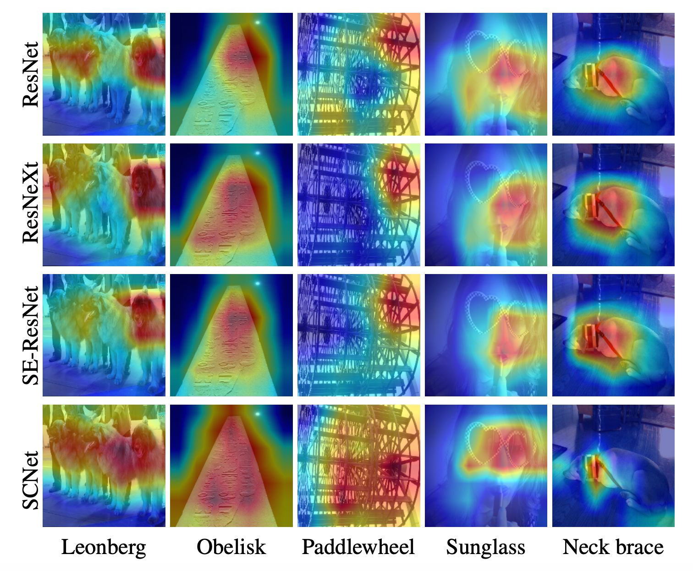

# Deep Learning Related Topics

## ResNeXt

> 传统为增加深度（层数）和宽度（特征维度），变成结合VGG的堆叠网络+Inception的 _split-transform-merge_ 策略。增加准确率和可扩展性同时不改变或减小复杂度  

提出<u>**cardinality**</u>，表示多分支的分支数量，more effective

👆左为ResNet，右为ResNeXt cardinality=32
<u>**平行堆叠**</u>代替线性加深，不显著增加参数数量级增加准确率；同时平行分支的拓扑结构相同减少了超参数（设计成本）

👆split-transform-merge过程

👆三种等价的结构，第三种简洁，速度更快

- - - -

## 卷积大小

$O=\lfloor\frac{W-F+2P}{S}\rfloor+1$

**Dilated Conv**

$O=\frac{W+2P-(d(k-1)+1)}{S}+1$

## MobileNet

把传统卷积变成depth-wise卷积和1x1卷积
标准卷积（Dk卷积核大小，Df输出特征图尺寸，M输入通道，N输出通道）
$D_K\times D_K\times M\times N\times D_F\times D_F$
**深度可分离卷积**：depth-wise卷积和`1x1`卷积

$D_K\times D_K\times M\times D_F\times D_F + M\times N\times D_F\times D_F$

Depth卷积把输入特征图Dk x Dk x M成Df x Df x M层，然后`1x1`把M层变为N层输出

👆<u>**depth-wise conv**</u>不同特征图通道使用不同卷积核，M层特征图卷积还是M层（不相加）所以`Dk x Dk x M x Df x Df`（一个卷积核计算`Dk x Dk`次，构成输出特征图的一个点，所以一张输出特征图一共计算`Dk x Dk x Df x Df`次，一共M层）

👆depth-wise解释

👆<u>**point-wise conv**</u>不同特征图使用同一个卷积核，但是1x1。把M通道卷积成N通道，所以`M x N x Df x Df` （一个卷积核计算M层相加，再计算N次构成N通道）

👆point-wise解释

---

## Convolution

参数量 `H x W x C1 x C2`

## Group Convolution

卷积核之间的关系是**稀疏**的。group conv减少卷积核之间的关联性， **regularization**，减少过拟合
Ref: [A Tutorial on Filter Groups (Grouped Convolution) - A Shallow Blog about Deep Learning](https://blog.yani.io/filter-group-tutorial/)

---

## MobileNet V2

增加<u>**inverted residual with linear bottleneck**</u>，首先升维，卷积，再降维。 <u>特征提取在高维空间进行</u> 。纺锤形，和resnet的hour-glass相反，所以inverted
在DW之前 <u>**增加PW卷积**</u>：上一层通道数少，则DW只能在低维空间提取特征，增加PW后，先升维，再提DW特征

去掉了第二个PW的 <u>**激活函数**</u> ：只有在高维空间中，激活函数可以增加非线性；而在低维空间中，激活函数会破坏特征。因此采用线性
增加 **shortcut** 连接，输出与输入相加：同ResNet

- - - -

## ShuffleNet

> 组内point-wise卷积，增加shuffle操作通道之间信息沟通  

👆a：normal，b：分组卷积，c：channel shuffle

*另一种理解👇*

#### Channel shuffle

👇<u>**展开，转置，平铺**</u>

👆对比mobilenet，shufflenet和shufflenet降采样
👆g采用分组卷积，g小；去掉ReLU，减少信息损耗；降采样保证参数量不骤减，需要增加通道数量，采用concat而不是element-wise add
**性能评价**：MAC访存，GPU并行性
**设计准则**

* 当输入通道数和输出通道数相同时，MAC最小
* MAC与分组数量g成正比（谨慎使用分组卷积）
* 网络的分支数量降低并行能力（卷积核加载和同步），单分支速度快--网络结构简单
  * ResNeXt准确率提升但是速度慢
* Element-wise操作是非常耗时

👆shufflenet v2和downsample
增加**通道分割**，通道分为c1和c2输入到两个分支中，使用concat替代element-wise add
堆叠block的时候，可以将concat, channel-shuffle, channel-split合并为一个element-wise操作
思想—<u>**特征重用**</u>，上层的feature map直接传入之后的模块，直接映射（shufflenet v2左侧分支）

- - - -

## SqueezeNet

> <u>**分块设计**</u>思想，模型<u>**压缩**</u>

1. 使用`1x1`卷积代替`3x3`卷积  
2. 减少`3x3`卷积输入通道数  
3. 延迟下采样，前面layer获得更大特征图提升性能  

**Fire Module**

两层卷积操作：squeeze `1x1`, expand `1x1 + 3x3`

👆👇 <u>squeeze是单分支，expand是二分支</u>  

部分3x3变成1x1，参数数量减少，但为获得性能需要加深网络深度，同时并行能力下降，也导致测试时间变长

👆网络结构

- - - -

## Squeeze-and-Excitation Networks

[arXiv](https://www.arxiv.org/pdf/1709.01507.pdf)  
卷积核：空间维度信息，特征维度信息聚集  
空间spatial：inception(multiscale)，inside-outside(context)  
SENet->特征维度,feature channel  
Motivation:

1. Explicitly model channel-interdependcies
2. Feature recalibration: enhance useful, suppress less useful

特征通道之间的关系：特征重标定（通过学习的方式来自动获取到每个特征通道的重要程度，然后依照这个重要程度去提升有用的特征并抑制对当前任务用处不大的特征）  
Squeeze: global pooling, 顺着空间维度压缩，增加全局空间信息，每一个二维特征图变为一个实数。表示特征通道上全局分布，加上S模块使得靠近输入的层也可以获得全局感受野  
Excitation: like gate in RNN. 每个通道生成权重，建模相关性，capture channel-wise dependencies  
W的要求 * learn non-linear interaction * learn a non-mutually-exclusive relationship since we would like to ensure that multiple channels are allowed to be emphasised opposed to one-hot activation  
Reweight: multiply with feature map  

嵌入Inception：  
嵌入ResNet： addition之前进行scale操作，防梯度弥散

---

## Hard Negative Mining in SSD & Focal Loss

1. Hard Negative Mining in SSD 作为中间结果处理的步骤。只有GT框/和GT框IoU大于阈值的才是正样本（即正确检测框，数量少），其他都是负样本（即错误的检测框，数量大）

   > <u>**为了正负样本数量平衡**</u>，防止少量关键的（提升性能）的负样本被大量正样本掩盖而无法被学习/优化到。   
   > 解决错误样例太多，<u>**正确样例太少**</u>，掩盖正确样例的问题。  

    **Hard Negative Mining in SSD**: 直接通过根据置信度损失，<u>**排序筛选**</u> 来选择分类损失最大的负样本（即不是物体但是有最高的分类置信度 -> 困难分类样本_迷惑性，丢弃不是物体但分类置信度相对较低 -> 简单_错误不严重/不明显），只保留分类置信度损失较大的，人为保证样本数量平衡。

2. Focal Loss 用于损失函数中

   > <u>**为了能学到困难样例**</u>，学到更多，不被简单掩盖。  
   > 解决错误样例中，<u>**简单的错误样例太多**</u>，困难错误样例太少，且求和后掩盖困难的错误样例，而导致检测器学不到困难的错误样例（真正需要学/优化的）。  

    **Focal Loss**: 通过给不同置信度的样本<u>**增加权重**</u>的方法。接近0/1为简单样本，接近0.5为难样本。所以正例x (1-p)，负例x p，使用 _不确定程度_ 作为权重。难易的错误都会学，但困难的错误对loss影响更大。
    $L(p,y)=-(y\cdots (1-p)\cdots \log(p)+(1-y)\cdots p\cdots\log(1-p))$

---

## One-stage & Two-stage detector

#### RCNN

## ICCV 2019 workshop

#### LPIRC

https://rebootingcomputing.ieee.org/lpirc/2019
Winner talk:  [http://ieeetv.ieee.org/conference-highlights/award-winning-methods-for-lpirc-tao-sheng-lpirc-2018?rf=series|3](http://ieeetv.ieee.org/conference-highlights/award-winning-methods-for-lpirc-tao-sheng-lpirc-2018?rf=series%7C3) 
 [http://ieeetv.ieee.org/conference-highlights/deeper-neural-networks-kurt-keutzer-lpirc-2018?rf=series|3](http://ieeetv.ieee.org/conference-highlights/deeper-neural-networks-kurt-keutzer-lpirc-2018?rf=series%7C3) 
_Real Time Object Detection On Low Power Embedded Platforms_
_1810.01732.pdf_

#### Compact and Efficient Feature Representation and Learning

http://www.ee.oulu.fi/~lili/CEFRLatICCV2019.html
DCNN network quantization and compression, energy efficient network architectures, binary hashing techniques and data efficient techniques like meta learning

---

## Triplet Loss

三元组: [anchor, positive, negative] 拉近pos，推远neg

$\mathcal{L}_{\mathrm{tri}}(\theta)=\sum_{a, p, n \atop y_{a}=y_{p} \neq y_{n}}\left[m+D_{a, p}-D_{a, n}\right]_{+}$

> 选出B个triplets，只用了B个训练，实际上可以有`6B^2-4B`种triplets的组合（_B个anchor，pos固定一对一，除此二其他所有都可以为neg，3B-2种；anchor和pos交换乘2_） `2*B*(3B-2)`种  

难训练，需要**triplet mining**。分出hard，semi-hard，easy三种样本

1. <u>**Batch-Hard**</u>
   <u>选择P个类别（人），每个类别K个样本（照片），PK个样本作为anchor</u> 。每个anchor只选择**距离最远的pos和距离最近的neg**（最hard）

   $\mathcal{L}_{\mathrm{BH}}(\theta ; X)=\overbrace{\sum_{i=1}^{P} \sum_{a=1}^{K}}^{\text {all anchors}} \left[m +  \overbrace{\max_{p=1 \ldots K} D\left( f_{\theta}\left(x_{a}^{i}\right), f_{\theta}(x_p^i)\right)}^{\text {hardest positive}} - \underbrace{\min\limits_{j=1 \ldots P,\; n=1\ldots K \atop j \neq i} D\left(f_{\theta}\left(x_{a}^{i}\right), f_{\theta}\left(x_{n}^{j}\right)\right)}_{\text {hardest negative}}\right]_{+} $
   一共$P_K$个triplets

2. <u>**Batch-All**</u>
   选择P个类别（人），每个类别K个样本（照片），PK个样本作为anchor，loss计算所有的pos和所有的neg（和baseline选法相同）

   $\mathcal{L}_{\mathrm{BA}}(\theta ; X)= \overbrace{\sum_{i=1}^{P} \sum_{a=1}^{K}}^{\text {all anchors}} \overbrace{\sum_{p=1 \atop p \neq a}^{K}}^{\text{all pos.}} \overbrace{\sum_{j=1 \atop j \neq i}^{P} \sum_{n=1}^{K}}^{\text {all neg.}}\left[m+d_{j, a, n}^{i, a, p}\right]_{+}$

   $d_{j, a, n}^{i, a, p}=D\left(f_{\theta}\left(x_{a}^{i}\right), f_{\theta}\left(x_{p}^{i}\right)\right)-D\left(f_{\theta}\left(x_{a}^{i}\right), f_{\theta}\left(x_{n}^{j}\right)\right)$
   $P_K$个anchor，每个有$K-1$的pos，$P_K-K$个neg（其他所有类别的样本）。一共$P_K(K-1)(P_K-K)$个triplets

---

## Long Short Term Memory (LSTM)

> Handling long-term dependencies

LSTM blocks👇

#### Core idea

👆**Cell state** convey information straight down along the entire chain

👆**Gate** controls whether add/remove information to the cell state

---

👆**Forget Gate**: how many last state information($c_{t-1}$) keep/forget.

👆**Input Gate**: what new information we’re going to store in the cell state.

Two parts: **sigmoid** layer decide which part of values we will update, **tanh** layer create a vector of new candidate values $\tilde{C}_t$

👆Apply to cell state: forget first, then partially add new candidate

👆**Output Gate**: decide what we’re going to output

Two parts: **sigmoid** layer decide which parts of the cell state going to output, **tanh** layer filters cell state. **Multiply** them together to get final output.

---

#### Variants

**1. Peephole Connection**

gate layer look at the cell state

**2. Input&Forget Together**

make what to forget and what to add together. Only forget when going to input something, only input when we forget.

**3. Gated Recurrent Unit**

Combines the forget and input gated into "update gate". Merge the cell state and the hidden state.

[Reference](https://colah.github.io/posts/2015-08-Understanding-LSTMs/)

---

## NASNet

> 先在小数据集中训练网络单元，再在大数据集中堆叠单元  

学习网络中堆叠的网络单元1. Normal cell尺寸不变 2. Reduction cell减尺寸
控制器：一直在执行两个特征图的<u>**融合**</u>

选择第一个feature map和第二个feature map(灰色) `2` ，计算输入的feature map A B(黄色) `2` ，选择操作融合两个feature map(绿色) `1` 
RNN预测，输出`2 x 5 x B`其中 _normal cell_ + _reduction cell_ ；每个都有B个块堆叠；每个block有五个输出👆
NASNet迁移学习优化策略为Proximal Policy Optimization(PPO) 👈 
提出**scheduled drop path**，随机丢弃部分分支，增加网络冗余overfitting，类似「Inception」
丢弃概率随时间线型增加，训练次数多容易过拟合

---

## DetNAS

**weight sharing** inherit its weights from supernet instead of training from scratch
**joint optimization** weight and architecture
**No proxy task or dataset** 不需要提前训练小网络/小模块，也不需要从小数据集到大数据集训练
**train from scratch** 更多迭代，不适用于小数据集
首先训练(pretrain+finetune)一个supernet，然后再supernet空间中找；直接在det任务`Vdet`上搜索 <u>proxyless</u> 👇

优点：

1. Decoupling: 没有weight和architecture之间的bias interaction

2. <u>supernet训好后，直接用val在supernet上搜索</u> 特定应用场景的结构，而不是finetune

#### 训练supernet👇

1. Single path sampling: 使训练和测试的配置一致
   

2. 同步BN: <u>BN can not be frozen</u>, 不同path BN的参数不同（GroupNorm速度慢）

#### 搜索子网结构

遍历每个path，需要重新在trainset上搜集计算BN的mean和var
不用trainset训练子网，而直接在valset上eval

#### Target task dataset上finetune子网结构

---

## Self-supervised Sample Mining

> <u>**semi-supervised**</u> <u>**weakly-supervised**</u> 使用未标注的数据提升模型性能   

这个框架有两个阶段，分别是通过SSM对高一致性样本进行伪标注阶段和通过AL选择低一致性样本阶段。首先使用已标注的图片对模型进行fine-tune，对未标注或部分标注的图片提取region proposals（未标注样本），把这些 **region proposals <u>粘贴</u> 到已标注的图片中进行交叉图片验证，根据重新预测出来的置信度确定如何对未标注样本进行标注** 。对于高一致性样本，直接进行伪标注，对于低一致性样本，通过AL挑选出来，让相关人员进行标注。伪标注的样本用于模型的fine-tune，而新标注的样本添加到已标注的图片中，同时也用于模型的fine-tune  
对于好的样本`xi`，proposal中的内容可以很好的展示j类的特征，粘贴到没有j类的图片中，新生成的图片中的proposal有包含`xi`的proposal，且具有很大的概率值，<u>**高一致性**</u>认为之前的样本框准确无错误➡️正样本
任务分类👇

---

## Bi-box Regression for Pedestrian Detection and Occlusion Estimation

> Part detector，针对行人遮挡问题，回归「全身」+「可见」两个框  

二分支网络：

1. **Full body estimation** 只对pos proposal回归
2. **Visible part estimation** 对pos和neg的proposal回归（FG&BG）， <u>neg proposal回归缩小区域 $\to$ 0</u>
   pos/neg proposal根据和标注(full-body)的IoU决定
   
   👆proposal由RPN获得，softmax1和softmax2预测行人得分。 <u>fuse</u> 时，两个都为pos，输出p更高；一个为neg，另一分支pos，则pos分支增加p

#### Training

<u>样本标注两个框 (vis/full)</u>。把产生的proposal`P={x,y,w,h}`和标注框`Q=(Full,Vis)`match，pos-proposal规则为`IoU(P,F)>thresh_1` && `C(P,V)>thresh_2`. C定义为👇$C(P,\bar{V})=\frac{\text {Area}(P\cap\bar{V})}{\text {Area}(\bar{V})}$

训练样本`X=(Img, P, cate=1, F, V)`，regression target为👇
$\bar{f}^x=\frac{\bar{F}^x-P^x}{P^W},\;\bar{f}^y=\frac{\bar{F}^y-P^y}{P^h}$

$\bar{f}^w=\log(\frac{\bar{F}^w}{P^w}),\;\bar{f}^h=\log(\frac{\bar{F}^h}{P^h})$

Neg-proposal=1.background   2.poorly aligned proposal   回归w,h -> 0

> Why should force _visible part of neg-proposal_ shrink? 「vis分支对pos和neg都处理」 #没懂  
> If the visible part estimation branch is trained to only regress visible parts for positive pedestrian proposals, the training of this branch would be dominated by pedestrian examples which are non-occluded or slightly occluded. For these pedestrian proposals, their ground-truth visible part and full body regions overlap largely. As a result, the estimated visible part region of a negative pedestrian proposal is often close to its estimated full body re- gion and the difference between the two branches after training would not be as large as the case in which the visible part regions of negative examples are forced to shrink to their centers.  

不对负样本处理，则对负样本的预测结果两个分支相同「full分支对所有样本回归到GT，vis分支对正样本回归到GT，对负样本回归到0」

👆蓝色框，和full(GT)重合度高，但和vis重合度低。在Faster-RCNN中被认为pos，在本文中认为neg。更强的评价标准

---

## Precision Gating: Improving Neural Network Efficiency with Dynamic Dual-Precision Activations

<u>**网络量化**</u>
Network compression: sparsity, quantization, and binarization
使用低精度的浮点运算，相比于静态确定每个weight和activation的精度，本文**根据网络输入**(例如背景不需要精确计算)动态确定 **Tuning the bit width per layer**

#### Precision Gating

> Computes most features with low-precision arithmetic ops and only updates few important features to a high-precision  

1. 对于所有层低精度计算
2. 对于输出的feature map中较大值认为重要特征，对其进行稀疏更新，提高精度(sparse back propagation)

用在shufflenet v2上提升26% ImageNet分类精度

---

## Repulsion Loss: Detecting Pedestrians in a crowd

> ReId的occlude问题，使不同目标的检测框远离「类似triplet loss」  

$L=L_{Attr}+\alpha*L_{RepGT}+\beta*L_{RepBox}$

#### Attraction term

采用检测框架中bbox回归loss

$L_{\mathrm{Attr}}=\frac{\sum_{P \in \mathcal{P}_{+}} \operatorname{Smooth}_{L 1}\left(P, G_{A t t r}^{P}\right)}{\left|\mathcal{P}_{+}\right|}$

#### Repulsion Term (RepGT)

和周围GT目标框远离，远离IoU大且没有匹配的目标框
即$G_{R e p}^{P}=\underset{G \in \mathcal{G} \backslash\left\{G_{A t r}^{P}\right\}}{\arg \max } \operatorname{IoU}(G, P)$

类似IoU loss（不是IoU而是IoG：若最小化IoU，则预测框越大IoU越小）

$\operatorname{IoG}(P,G) \overset{\triangle}{=}\frac{area(P\cap G)}{area(G)}$

$L_{\mathrm{RepGT}}=\frac{\sum_{P \in \mathcal{P}_{+}} \operatorname{Smooth}_{ln}\left(\operatorname{IoG}(P, G_{Rep}^{P})\right)}{\left|\mathcal{P}_{+}\right|}$

where

$\operatorname{smooth}_{l n}=\left\{\begin{array}{ll}
{-\ln (1-x)} & {x \leq \sigma} \\
{\frac{x-\sigma}{1-\sigma}-\ln (1-\sigma)} & {x>\sigma}
\end{array}\right.$
使预测框集中在匹配的目标附近，而不会偏移到临近物体

#### Repulsion Term (RepBox)

预测框和其他预测框远离（匹配上不同物体的目标框）
$L_{\mathrm{RepBox}}=\frac{\sum_{i \neq j} \operatorname{Smooth}_{l n}\left(\operatorname{IoU}\left(B^{P_{i}}, B^{P_{j}}\right)\right)}{\sum_{i \neq j} \mathbb{1}\left[\operatorname{IoU}\left(B^{P_{i}}, B^{P_{j}}\right)>0\right]+\epsilon}$

防止不同物体的两个检测框被NMS过滤掉

---

## Normalization

输入$X$， 输出$Y$，参数$\gamma$和$\beta$ (parameters, 每个特征图一对)

$y_i=\gamma\cdot\frac{x_i-\mu}{\sigma}+\beta$

Where $\mu=\frac{\sum_i^Nx_i}{N}$, $\sigma=\sqrt{\frac{\sum_I^N(x_i-\mu)^2}{N}+\epsilon}$ 均值和方差 (batch statistics)

统计不同样本在同一个channel同一位置数据的均值方差 (reduce at batch dim hwc)

反向传播时，由于均值和方差是输入的函数

$\frac{d_{\ell}}{d_{x_{i}}}=\frac{d_{\ell}}{d_{y_{i}}} \cdot \frac{\partial_{y_{i}}}{\partial_{x_{i}}}+\frac{d_{\ell}}{d_{\mu}} \cdot \frac{d_{\mu}}{d_{x_{i}}}+\frac{d_{\ell}}{d_{\sigma}} \cdot \frac{d_{\sigma}}{d_{x_{i}}}$

where $\frac{\partial_{y_{i}}}{\partial_{x_{i}}}=\frac{\gamma}{\sigma}$, $\frac{d_{\ell}}{d_{\mu}}=-\frac{\gamma}{\sigma}\sum_i^N\frac{d_{\ell}}{d_{y_{i}}}$, $\frac{d_{\sigma}}{d_{x_{i}}}=-\frac{1}{\sigma}(\frac{x_i\mu}{N})$

Ref: https://kevinzakka.github.io/2016/09/14/batch_normalization/

[https://kiddie92.github.io/2019/03/06/卷积神经网络之Batch-Normalization（一）：How？](https://kiddie92.github.io/2019/03/06/卷积神经网络之Batch-Normalization（一）：How？/)

[https://www.cnblogs.com/shine-lee/p/11989612.html](https://www.cnblogs.com/shine-lee/p/11989612.html#卷积层如何使用batchnorm？)

#### Training

==Batch Norm==对一个batch中所有样本的同一channel计算统计量，受batch_size影响

==Layer Norm==对单个样本计算统计量，用于RNN

==Instance Norm==单样本单通道计算，风格迁移

==Group Norm==对通道分组，解决BN依赖batch_size的问题

> 同一层特征通道之间关联性强，特征具有相同分布，可以group

Switchable Normalization计算BN、LN、IN三种的统计量，然后加权$w_k$作为SN的均值$\mu$和方差$\sigma$「解决batch_size影响，自适应不同任务」

norm👇

$\hat{h}_{n c i j}=\gamma \frac{h_{n c i j}-\Sigma_{k \in \Omega} w_{k} \mu_{k}}{\sqrt{\Sigma_{k \in \Omega} w_{k}^{\prime} \sigma_{k}^{2}+\epsilon}}+\beta$

加权权重归一化👇

$w_k=\frac{e^{\lambda_k}}{\sum_{z\in\{\text {bn,ln,in}\}}e^{\lambda_z}}$

#### Testing

LN, IN正常计算，BN采用<u>batch average</u>方式，具体过程是，冻结所有的参数，从训练集中随机抽取一定数量的样本，计算SN的均值和方差，然后使用他们的平均值作为BN的统计值

Ref: [https://zhuanlan.zhihu.com/p/39296570](https://zhuanlan.zhihu.com/p/39296570)

### Sync BN

> 多卡训练时，传统BN只在单GPU上归一化，改成多个GPU之间同步信息；性能明显提升

通过计算均值和方差的中间量$\sum x$和$\sum x^2$，只需同步一次

根据$D[x]=E[x^2]-E[x]^2$

**FP** 计算均值和方差 $\mu=\frac{\sum x}{N}$, $\sigma=\sqrt{\frac{\sum x^2}{N}-\mu^2+\epsilon}$

**BP** 计算$\frac{d_{\ell}}{d_{x_{i}}}$, $\frac{d_\ell}{d_{\sum_k x}}$和$\frac{d_\ell}{d_{\sum_k x^2}}$，都可以单卡上计算，只同步一次

Ref: https://hangzhang.org/PyTorch-Encoding/notes/syncbn.html

**Improvement**: MABN(移动平均+减少统计量+中心化权重) [https://arxiv.org/abs/2001.06838](https://link.zhihu.com/?target=https%3A//arxiv.org/abs/2001.06838)

---

## Universal-RCNN: Universal Object Detection via Transferable Graph R-CNN

> 解决检测域迁移，不同域<u>**类别**</u>关系推理()reasoning)和迁移(transfer)

**Intra-Domain Reasoning**: 域内部图表示上传播，类别之间相关性

**Inter-Graph Transfer**: 域间迁移，不同域类别之间层次关系

#### Intra-Domain Reasoning Module

1. 使用backbone计算proposal feature (global **semantic pool**)

2. 构建**区域**关系图$G_{T\to T}$，节点表示region proposal，边表示关系。proposal之间关联关系(attribute similarities, interactions)

3. 学习边权重$\mathbf{Z}\mathbf{Z}^T$，只保留重要proposal关系的**稀疏邻接矩阵**

4. propsoal feature在GCN计算，和原始特征concat，得到新的global semantic pool $\mathbf{P_S}$

sharing common features between categories via connected edges such as similar attributes & relations.

improve feature rep. by adding adaptive contexts from global semantic pool

#### Inter-Domain Transfer Module

> bridge the gap between domains

源域用上述模块构建$\mathbf{P_S}$，构建$\mathbf{G_{S\to T}}$，GCN计算从源域到目标域迁移，concat源域特征

---

## Model-Agnostic Structured Sparsification with Learnable Channel Shuffle

> 划分group，conv$\to$group conv，分组进行通道shuffle

常见网络压缩方式 

1. 量化权重weight quantization 

   低精度表示，易性能下降

2. 知识蒸馏knowledge distillation 

   易受教师网络影响

3. 网络剪枝network pruning

   去掉部分unimportant网络参数 (eg. filter pruning algo.)

参数weight norm来判断是否prune「L1正则化可增加sparsity」

使用GroupConv使通道间稀疏连接

使用learning-based通道shuffle增强inter-group info flow

**步骤**：使用structured regularization训练大模型 $\to$ 将部分conv转为group conv $\to$ finetune恢复精度

#### connectivity patterns

卷积核权重值$W_{j,i}$认为input output channel之间关联性

卷积**groupable**：权重可以排列成**block diagonal**

👇一般conv的weights（channel之间关联程度）

👇groupable conv，一个channel只和同组内几个channel有高响应，即block diagonal（👇有两个block，cardinality=2，每个block中的对角块0惩罚，block中左下右上块0.5惩罚，block块外1惩罚，见下下图）

变为学习==划分channel==问题，损失函数惩罚左下右上没有被zero-out的权重，使用coordinate descent计算（线性规划问题，or optimal transport）

#### Structured regularization

channel shuffle解释👇

## Cosine Learning rate decay

1. warm up：训练开始将lr从0逐步增加到初始值
2. decay：使用cosine函数

常见为step devay

Ref: https://medium.com/@scorrea92/cosine-learning-rate-decay-e8b50aa455b

## Learning When and Where to Zoom with Deep Reinforcement Learning

> 分类任务中学习如何缩放，spatially-sample

**Attention**：<u>先LR</u>用saliency network产生attention map，然后<u>映射</u>到HR图片上使用

学习：根据LR图像决策sample哪些HR图像。sample成本和准确率tradeoff

1. 👆由LR图片通过policy network计算出需要zoom-in的grid
2. 直接在HR上直接sample相应位置，构成path
3. HR-patch和LR原图片(optional)输入分类网络分类
4. 分类损失reward返回给policy network

适用于遥感/高分辨率图片分类/检测(?)

---

### Jaccard distance

衡量两个set之间的距离

**Jaccard index**: $J(X,Y)=\frac{|X\cap Y|}{|X\cup Y|}$

**Distance**: $D(X,Y)=1-J(X,Y)$

Ref: https://www.statisticshowto.datasciencecentral.com/jaccard-index/

---

### Label Smoothing

针对数据集中**错误标注**，使`[0, 1]`变成`[0.2, 0.8]`，减弱正样本的loss，冲淡错误信号的影响

$new\_onehot\_labels = labels * (1 - label\_smoothing) + label\_smoothing * \frac{1}{|labels|}$

$new\_label=[0\;1]\times(1-0.2)+0.2\times \frac{1}{2}=[0.1\;0.9]$

> Large logit gaps combined with the bounded gradient will make the model less adaptive and too confident about its predictions.

---

## BiDet: An Efficient Binarized Object Detector

> 二值神经网络，使用Information Bottleneck理论简化网络(作为一个损失函数)

检测任务看作$X\to F\to L,C$，图片到特征到类别位置

**Information Bottleneck理论**

目标为$\min _{\phi_{b}, \phi_{d}} I(X ; F)-\beta I(F ; C, L)$

最小化特征提取的互信息（信息增益，知道A对确定B的影响），最大化检测网络的互信息

*互信息可以看作网络的信息损失，互信息大，信息损失大。前半部分为网络提取足够的特征，后半部分为只检测有效的框，去除冗余信息*

**损失函数**：$\begin{aligned}
&\min J=J_{1}+J_{2}\\
&\begin{aligned}
=&\left(\sum_{t, s} \log \frac{p\left(f_{s t} | \boldsymbol{x}\right)}{p\left(f_{s t}\right)}-\beta \sum_{i=1}^{b} \log \frac{p\left(c_{i} | \boldsymbol{f}\right) p\left(\boldsymbol{l}_{1, i} | \boldsymbol{f}\right) p\left(\boldsymbol{l}_{2, i} | \boldsymbol{f}\right)}{p\left(c_{i}\right) p\left(\boldsymbol{l}_{1, i}\right) p\left(\boldsymbol{l}_{2, i}\right)}\right) \\
&-\gamma \cdot \frac{1}{m} \sum_{i=1}^{m} s_{i} \log s_{i}
\end{aligned}
\end{aligned}$

其中$J_1$为IB理论的优化目标，类别多项式分布，位置正态分布，$p\left(f_{s t} | \boldsymbol{x}\right)$通过采样得到

$J_2=-\gamma \cdot \frac{1}{m} \sum_{i=1}^{m} s_{i} \log s_{i}$为减少一张图中目标的自信息($s_i$为第i个物体的objectness)。把一张图的多个物体分为多个block，使$\sum^{m}_{i}s_i=1$目标conf和为1，减少目标数量/假阳性，即让一张图内不要有多个high objectness的物体，限制为只有少量物体「<u>适用于每张照片目标较少的数据集</u>」

---

## Mixup: Beyond Empirical Risk Minimization

常见网络训练为**ERM**：训练数据为经验，记住所有样本，不能<u>泛化</u>

数据增强可以理解为**VRM (vicinal risk minimization)**：领域风险最小化，构造数据集样本的领域值，学习领域的小变化，但方式<u>dataset-dependent&heuristic</u>

提出利用线性插值产生新的标注样本对，混合到数据集中训练「增加有噪声的样本」

$\tilde{x}=\lambda x_i+(1-\lambda)x_j$

$\tilde{y}=\lambda y_i+(1-\lambda)y_j$

其中$(x_i,y_i)$和$(x_j,y_j)$为数据集中「标注-样本」对，$\lambda\in [0,1]$

---

## Hybrid Task Cascade for Instance Segmentation

> 实例分割，级联，mask和box同时采用cascade方式refine

👆级联refine，box和mask两个分支。接受上一stage回归后的box作为输入，预测新的mask和box

👆mask1是box1经过pool之后得到的，mask和box两个分支有交互，box$\to$mask

👆mask之间也进行信息交互

交互方式👆，上一个stage的mask经过`1x1` conv，然后和box_pool相加，上一个stage的mask和box共同产生下一个stage的mask

👆最后加入语义信息分支

性能极强，速度慢👇

---

## 模型集成/集成学习

多个弱学习器集成组合为更精确更鲁棒模型

单个模型 或为高偏置（低自由度模型），或为高方差（高自由度模型）。根据弱学习器的性能选择集成方法，高偏置使用`compose`，高方差使用`average`

#### Bagging (bootstrap+aggregating)

并行的独立学习多个同质弱学习器，目标为**减小方差**

1. 使用bootstrap方法从源数据集取样N个数据集，计算统计量「置信度，representative samples」
2. 使用N个数据集独立训练N个弱学习器
3. 最终结果由N个模型的预测投票得到

如：随机森林

#### Boosting

迭代的拟合模型，串行，目标为**减小偏置**

1. 训练集成学习器
2. reweight数据集「关注难样本」
3. 加入新的弱学习器$s_{l}(.)=s_{l-1}(.)+c_{l} \times w_{l}(.)$ 「AdaBoost权重为$\arg\min\limits_{C_i} Error$ 性能越好贡献越大」

如：AdaBoost，GBDT

#### Stacking

多个弱学习器堆叠，学习元模型将其组合「例如：KNN+Logistic-Reg+SVM，NN将其组合」

1. 训练数据集分为两组
2. 第一组训练拟合弱学习器
3. 弱学习器在第二组上的预测，作为元模型的输入。在第二组数据集上拟合元模型

Ref: https://www.jiqizhixin.com/articles/2019-05-15-15, https://zhuanlan.zhihu.com/p/27689464

---

## Improving Convolutional Networks with Self-Calibrated Convolutions (SC Conv / SCNet)

> 在 Group Conv基础上改进卷积 heterogeneous
>
> 拆分为不规则的操作
>
> 增大感受野，大范围的context

首先把原始特征图<u>通道上</u>分为两部分 `Group Conv`

$\mathbf{X_1}$为**Self-Calibration**分支，$\mathbf{X_2}$为卷积分支

#### Self-Calibration

分别在small scale的`latent`空间和large scale的`original`空间进行卷积操作，再融合`calibration`

**Latent空间**：

$\mathbf{T}_{1}=\operatorname{AvgPool}_{r}\left(\mathbf{X}_{1}\right)$ 下采样减小尺度

$\mathbf{X}_{1}^{\prime}=\operatorname{Up}\left(\mathcal{F}_{2}\left(\mathbf{T}_{1}\right)\right)=\mathrm{Up}\left(\mathbf{T}_{1} * \mathbf{K}_{2}\right)$ 小尺度上卷积并upsample回原尺度

**Original空间和latent空间融合**：$\mathbf{Y}_{1}^{\prime}=\mathcal{F}_{3}\left(\mathbf{X}_{1}\right) \cdot \sigma\left(\mathbf{X}_{1}+\mathbf{X}_{1}^{\prime}\right)$

$\sigma$ for sigmoid function

**Final output**：$\mathbf{Y}_{1}=\mathcal{F}_{4}\left(\mathbf{Y}_{1}^{\prime}\right)=\mathbf{Y}^{\prime} * \mathbf{K_4}$

Self-calibration在小尺度操作，可以扩大感受野 (*Regional context*)，融合多尺度的信息

---

## Strip Pooling: Rethinking Spatial Pooling for Scene Parsing

> 带状pooling，各向异性特征，分割任务

长条形感受野，行感受野在每一行的所有列进行average，<u>压缩到1列</u>，pooling结果为列向量；列感受野在每一列的所有行average，<u>压缩到一行</u>，pooling结果为行向量

然后扩展成原图尺寸，再fusion

对长条状物体又帮助，可以集合任意两个位置的dependency (long-range)

---

## Res2Net: A New Multi-scale Backbone Architecture

> 多尺度卷积，通用，但速度有下降；基于ResNet，可用于ResNeXt

将一个卷积分成不同深度的操作，获得不同尺度的空间/语义信息

相比ResNet，减少参数量提性能。同样GFLOPS，速度会慢，但精度更高；同样精度下，速度更快。

---

