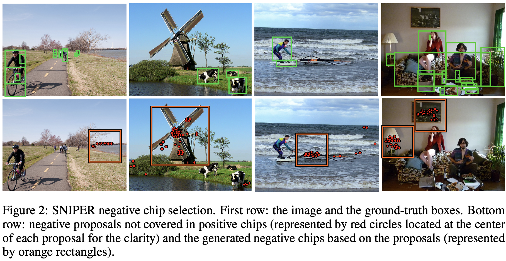

# Object Detection

## mAP

> AP is averaged over all categories. Traditionally, this is called “mean average precision” (mAP). We make no distinction between AP and mAP (and likewise AR and mAR) and assume the difference is clear from context.  

[mAP (mean Average Precision) for Object Detection - Jonathan Hui - Medium](https://medium.com/@jonathan_hui/map-mean-average-precision-for-object-detection-45c121a31173)

---

## CornerNet

> anchor-free

#### Motivation

1. anchor box太多，只有少部分和GT重合
2. anchor 选择需要人为设计（数量，尺寸，比例），不同尺度anchor设置不同

两个部分： 1) 检测角网络，左上+右下 2) 嵌入网络，用于匹配角点

#### Method


**检测corner网络**：提特征之后，经过corner pooling产生每个类别的左上角和右下角的heat map。为正负样本匹配，只惩罚GT一定范围外的预测点（通过IoU threshold限制radius）
**计算嵌入embed网络**：用于匹配同框的左上右下。损失函数：同框左上和右下接近（variance小），不同框的平均embed距离大。
<u>**Corner pooling** </u>：解决角点特征少，取一条线上的最大值pooling

*Hourglass network*：提特征

**two stage得到预测框之后采用RoI pooling/align提取检测框内部的信息，只有内部信息(approx.)的特征再进行一次框定和分类（refine步骤）；而一阶段的方法在提取到特征之后分成两支进行框定和分类，没有对近似的只包含框内物体的特征(局部特征)进行再一次提取，所以精度较差**

-----

## CenterNet

> anchor-free

#### Motivation

CornerNet只用到边缘的特征信息，没有用到内部的特征信息（造成不止对物体的边缘敏感，也对背景的边缘敏感）。内部信息对于决定两个keypoint是否是同一个框有帮助。
CenterNet预测三元组：左上，右下，中心

#### Method


二分支：产生corner点并match形成框；产生center点。如果center点在框的central region，计算框，否则删除
<u>**central region**</u> 确定判定的中心区域的大小：大框偏小，小框偏大，整体线性

$\left\{\begin{array}{l}
{\operatorname{ctl}_{\mathrm{x}}=\frac{(n+1) \mathrm{tl}_{\mathrm{x}}+(n-1) \mathrm{br}_{\mathrm{x}}}{2 n}} \\
{\operatorname{ctl}_{\mathrm{y}}=\frac{(n+1) \mathrm{tl}_{\mathrm{y}}+(n-1) \mathrm{br}_{\mathrm{y}}}{2 n}} \\
{\operatorname{cbr}_{\mathrm{x}}=\frac{(n-1) \mathrm{tl}_{\mathrm{x}}+(n+1) \mathrm{br}_{\mathrm{x}}}{2 n}} \\
{\operatorname{cbr}_{\mathrm{y}}=\frac{(n-1) \mathrm{tl}_{\mathrm{y}}+(n+1) \mathrm{br}_{\mathrm{y}}}{2 n}}
\end{array}\right.$
N离散变化，过threshold后变系数n。小$\to$threshold$\to$大，3$\to$5

#### Enrich center&corner information

<u>**center pooling**</u> 用在预测中心点时，增加中心点的recognizable特征
中心区域的获取👇


```
例如找leftmost的（即把horizontal最大值传到最左边），每个点看自己到最右边的最大值，不断传，到最左可获得整条横线最大；找topmost（把vertical最大值传到最上面），每个点看自己到最下，不断传，到最上则可获得整条线最大
```

模块&示意图

<u>**cascade corner pooling**</u> 增加角点的特征，相比corner pooling增加内部，使其不对边缘敏感
沿着边缘找边缘最大值，再从边缘最大值的位置 *向内找内部最大值* ，最后两个最大值相加
模块&示意图


> Q: how to classification?  
> Need RoI align?  

---

## FCOS: Fully Convolutional One-Stage Object Detection

> anchor-free 消除anchor，减少IoU的计算和GT框的匹配。可以代替二阶段的RPN

按照像素进行预测<u>**per-pixel prediction**</u>，预测每一个像素点的四个维度的框 `(Left, Top, Right, Bottom)`👇


* 对于特征图上每一个点，对应一个原图上的框。直接把特征图上的像素点看成训练样本而不是在点上铺不同长宽比和大小的anchor框

* 对于一个点落在多个GT框中（ambiguous samples）选择最小的bbox作为target。同时通过multi-level prediction来减少数量。👇
  👆which bbox this location should regress？

* FCOS可以利用尽可能多的样本（特征图上的点形成的框）而不只是IoU足够大的anchor 来进行训练。每个点都去学习对框的预测，多个点共同产生多个类似的框，然后NMS选择最大的

* 对于ambiguous samples，采用多尺度特征图，每层限制4D vec中最大值的大小（<u>**限制每层特征图产生的bbox的大小**</u>），满足$m_i < \max(l,t,r,b) < m_{i+1}$。对于同一个点上多个框，因限制，所以在不同尺度特征图上构成的框进行regress，一个feature map上一个点只负责固定尺度的框回归。如果还出现重复，则选择尺寸最小

* 防止远离物体中心的点产生质量差的框，center-loss。
  
  $centerness^*=\sqrt{\frac{\min(l^*,r^*)}{\max(l^*,r^*)}\times \frac{\min(t^*,b^*)}{\max(t^*,b^*)}}$
  
  使<u>**左和右，上和下的长度尽可能相等**</u>。测试时centerness-weighted classification confidence，抑制偏远框👇
  
  网络结构👇
  

- - - -

## Mask RCNN

参考[https://zhuanlan.zhihu.com/p/37998710](https://zhuanlan.zhihu.com/p/37998710)

#### 网络结构


#### RoI Align


 👆loss计算时`w*h*c`的mask输出，只计算<u>分类分支预测的类别</u>对应channel的sigmod输出作为损失「**语义mask预测与分类预测解耦**」

---

## HBONet: Harmonious Bottleneck on Two Orthogonal Dimensions

> light-weight 

包含两个部分 _spatial contraction-expansion_ 和 _channel expansion-contraction_ ，独立作用在特征图的 orthogonal dimension。前者通过减少特征图大小减少计算量，后者通过提升informative feature提升性能

> mobilenet通过分离成*point-wise*和*depth-wise*来分别不变尺寸变通道数和不变通道数变尺寸(up/down sampling)     so called *depthwise separable conv*  
> shufflenet通过group conv减少通道上的计算量，channel-shuffle来增加不同通道之间的连接  
> 👆previous work focus on **channel transformation**, introduce **spatial feature dim(size)**  

* 提升通道数可以提升信息，但是增加计算开销. 提出*Two reciprocal components work on orthogonal dimension*.<u>**通道数扩展时，尺寸减少**</u>
* 相比mobilenet增加**spatial contraction缩小-expansion放大到输入的大小**，类似Squeeze-Excitation Network的先缩后放的思路
  模块，对比mobilenet👇
  
  计算量👇
  
* 增加residual path，减少主干计算and **feature reuse**. Inverted residual with harmonious bottleneck👇
  
* For Object detection: use **MobileNet V2 SSD** utilize the **warm-up** strategy which linearly ramps up the learning rate from a close-to-zero one 1e-6 to the normal initial learning rate of 1e-3 during the first 5 epochs. 

---

### SSD网络时间

1. 网络运行时间：0.002-0.003s 在GPU运行
2. detect（NMS为主）运行时间：0.013-0.016s 只在 _CPU_ 上运行 <u>**瓶颈**</u>

尺度减少，aspect ratio减少
Shallow feature map only for small
Deep ONLY large
低秩简化
PointRend

<u>**特征融合
cascade**</u>

---

## Cascade RPN

<u>Single anchor per location + multi-stage refinement</u>

#### Motivation

predefined anchor在GT和anchor对齐时限制性能/偏差，(#toread RoIPool RoIAlign)

1. **single anchor** + incorporates **criteria** of anchor/anchor-free in defining **positive** boxes
2. **adaptive convolution** to maintain the alignment between anchor boxes and features

Iterative RPN每次把anchor集合看作新的anchor进行refine，导致每次迭代后anchor位置和形状发生变化，anchor和表示anchor特征不匹配「 **anchor中心点的特征(即表示anchor的特征)不发生变化，但是anchor的位置发生变化** ，mismatch」
👆使用deformable conv解决，but _no constraint to enforce_ 🙅‍♂️

#### Adaptive Convolution

卷积采样的时候增加offset field
`offset = center offset + shape offset`中心的偏移和形状偏移(由anchor形状和kernel决定)


👆对比deformable conv：偏移量由anchor和kernel决定，非网络学习➡️anchor和feature对齐

#### Sample Discrimination Metrics

每个位置只有一个anchor，然后迭代refine

> Determining whether a training sample is pos/neg as the use of anchor/anchor-free is adversarial 两种方法决定正负样本的方法不同

👆即anchor-free的决定方式宽松/数量多，anchor-based标准严格/数量少
Stage 1: anchor-free➡️更多正样本「解决正负样本不匹配」
Stage 2: amchor-based➡️严格，数量减少，IoU高
`anchor-free`指FCOS，中心点在物体内为pos anchor
`anchor-based`指Faster RCNN，IoU threshold

#### Cascade RPN

前一个阶段的输出bridge到后一个阶段
由anchor计算出offset `o`，再和feature `x`输入regressor计算新的anchor ( $\sigma$就是anchor回归的目标 eg. $(tx-ax)/aw$ )


---

## DetNet

> 为检测任务设计backbone  

现有的ImageNet backbone： 1. 网络stage需要增加，且未在imagenet训过 2. down-sample和stride损失空间信息，大目标边界模糊 3. 小目标「空间分辨率低」

---

## TridentNet

> Scale variation $\to$ Different <u>**receptive fields**</u>  

多分支网络，分支结构相同权重共享，每个分支不同的感受野对应检测不同尺度范围的物体
不同感受野使用`dilated_conv`实现👉参数相同
权重共享：减少参数量，inference时只选择一个主分支


<u>Image Pyramid</u> (Multi-scale training&testing): time-consuming
<u>Feature Pyramid</u>: use different params to predict different scale (not uniform) 

**trident block**👇

**Scale-aware Training Scheme**：每个branch只对长宽在一定范围的proposal进行训练「一张图片使用不同branch(不同dilate rate)训练不同尺度的proposal」
其他参数相同(make sense?) 

**预测**：计算每个分支的预测输出，filter out掉超过尺寸范围的box **TridentNet Fast**：预测只采用单分支$\to$中间分支预测，得益于三分支权重共享，效果接近

---

## SNIPER: Efficient Multi-Scale Training

> 解决多尺度问题, 不构建feature pyramid, <u>**多尺度训练策略**</u>, 尺寸适应网络

**Scale Invariant**: *RCNN*将proposal缩放到同一个尺度，检测网络只需要学习一种尺度的检测。而为了适应不同尺度，多尺度训练的*Faster RCNN*对整个图片进行放缩，proposal也放大缩小，检测网络学习适应多种尺度。 <u>通过网络capacity记忆不同scale的物体</u> ，浪费capacity

> *Process context regions around GT instances(chips) at appropriate scale*  
> 截取固定尺寸的chip(eg `3x3, 5x5, 7x7`)对应不同尺度，然后resize到相同大小(low-res)去训练  
> 小目标zoom-in，大目标zoom-out  

#### Pos chips


👆chip从最小的cover某个GT box开始，直到最多的box被这个chip cover到
「chip尺寸不变，围绕cover这个GTbox转，直到最大化cover的box数量」

1. 每个box至少被一个chip cover
2. 一个物体可能被多个chip cover
3. 一个物体在不同尺度chip中可能valid or not
4. 截断的物体保留

#### Neg chips

👆只有pos chips会导致网络只对GT附近小范围的图片训练 *iconic*，缺乏 <u>背景</u> 。增加**难样本**作为neg chips
Metrics:

1. 如果区域没有proposal，认为是easy background，忽略
2. 去掉被pos chip cover的proposal「proposal和GT接近，易于区分」
3. 贪心选择至少cover M个剩余proposal的作为neg chips

训练时可控制neg chip数量，类似OHEM
<u>分辨率和准确率关系可能不大，过多context可能不必要</u>
Ref: [目标检测-SNIPER-Efficient Multi-Scale Training-论文笔记 | arleyzhang](https://arleyzhang.github.io/articles/f0c1556d/)

---

## HRNet: Deep High-Resolution Representation Learning for Visual Recognition

> 处理过程中保持高分辨率「position-sensitive task」  
> maintain high-res representation through the whole process  
> 不同于skip connection：高分辨分支平行conv，通过fusion而不是add融合高低分支，多分辨率输出  
> 不同于特征金字塔：高低分辨率平行计算（low-res增加分辨率下conv计算，不是通过high-res一次卷积downsample得到，**逐步平行**计算增加）  

先前网络：encode high $\to$ low，recover low $\to$ high
提出网络：运算时**保持高分辨率**分支，**平行**的加入低分辨率分支；**multi-res fusion**

#### Parallel multi-res conv

👆每个stage <u>逐步加入一个低分辨率(eg 1/2)</u> 分支，且保持原有分辨率分支
类似 <u>group conv</u> ，通道分别 $\to$ 分辨率分别

#### Repeated multi-res fusion

每个stage(4个unit/block)交换不同分辨率的信息
👆high $\to$ low: stride conv; low $\to$ high: bilinear upsampling + 1x1 conv
an <u>extra</u> output for lower res output👆融合类似FC

#### Multi-res representation head/不同任务不同输出模式

(a) 关键点检测 (b) segmentation (c) object detection

---

## Region Proposal by Guided Anchoring

> 更好的anchor，**改进产生anchor的过程**「非密铺」  
> anchor与feature: <u>**alignment**</u> + <u>**consistency**</u> 

两个分支分别对anchor的中心点和长宽进行预测，防止offset偏移过大，anchor和点的feature不对应
采用**deformable conv**使feature的范围和anchor的形状对应，每个位置anchor形状不同而capture不同的特征「加offset以适应anchor形状」


#### Guided Anchoring

$p(x,y,w,h|I)=p(x,y|I)p(w,h|x,y,I)$
**分两步产生anchor**「减小同时预测xywh时出现的偏移不对应」

1. location：预测objectness，之后采用mask_conv **减少区域计算**
   只对物体的中心(及附近)为pos训练，预测物体中心「边缘不容易回归框」
2. shape：预测每个位置上的best shape，位置不变只变长宽，不会misalign
   预测$w=k\times e^{dw}$，预测dw，而不是w，范围更大👇
   $w=\sigma \cdot s \cdot e^{dw}, \; h=\sigma \cdot s \cdot e^{dh}$

选择高于thresh的location中，概率最高的shape，产生anchor

#### Feature adaptation

**consistency**: 每点对应的anchor长宽不同，所以学习到特征对应区域的长宽也应该不同
$\mathbf{f}'_i=\mathcal{N}_T(\mathbf{f}_i,w_i,h_i)$
基于对应anchor的长宽，改变特征（xy不变，位置branch只预测objectness score）
👆使用deformable convolution实现

#### Anchor shape target

训练时anchor和gt box的匹配，训练目标。wh为变量，无法计算IoU

$\mathbf{vIoU}(a_{\mathbf{wh}},\mathbf{gt})=\max\limits_{w>0,h>0}{\mathbf{IoU}_{normal}(a_{\mathbf{wh}},\mathbf{gt})}$

方法：Sample常见的wh组合，计算和GT的IoU，得到vIoU👆，作为anchor和gt IoU的估计，之后采用常见anchor分配方法确定训练目标

#### High quality proposal

由于生成的anchor更好，pos样本数量更多。训练样本分布符合proposal分布
设置 <u>更高正负样本比例</u> ，同时 <u>更少样本</u> 数量，即 <u>更高IoU threshold</u>

---

## Soft NMS

> 解决密集 _相邻_ 物体的检测框重叠IoU大，可能在NMS过程中 <u>**误删**</u>  
> 密集物体检测有提升  

#### NMS

按照置信度排序，选择最大的box i保留。其余box中，与I的IoU>threshold的删除(置信度置为0)。再从剩下box选择最大保留，重复


#### Soft NMS

重叠IoU越大，置信度下降越多
置信度置为0变为更新IoU>threshold框的置信度

或

Ref: [NMS与soft NMS - 知乎](https://zhuanlan.zhihu.com/p/42018282)

---

## Matrix Nets: A New Deep Architecture for Object Detection (xNets)

> FPN处理不同大小的物体(特征金字塔)  
> 👇本文增加不同长宽比物体的处理 (大小金字塔+aspect ratio金字塔)  


高度，宽度减半。左下右上剪枝(物体不常见)
性能提升不明显，相比CenterNet参数量减少
Ref: [参数少一半、速度快3倍：最新目标检测核心架构来了](https://mp.weixin.qq.com/s?__biz=MzA3MzI4MjgzMw==&mid=2650768067&idx=2&sn=7133cf90287c91b297d857a57bdd6481&chksm=871a46bdb06dcfab0f4092acc96db5b8dc88c34937e7ea1a5e813e7d53a165d2549db0640068&scene=21#wechat_redirect)

---

## IoU-Net

**Add localization confidence in NMS**

#### NMS

1. 选择最大classification confidence的框$b_j$，加入集合$S$。
2. 其他所有不再集合中的框，如果和$b_j$的IoU大于threshold，则删去，简化重复框。
3. 重复知道没有框，$S$为结果。

使用分类置信度作为最开始选择框的依据，IoU用于计算分类置信度最大的框和其他框之间的重合度，删去框。

而IoU-Net使用预测的框和GT的重合IoU，即定位置信度，选择最大作为依据。在inference阶段发挥作用。

#### 预测IoU


通过网络预测IoU：使用FPN作为骨干网络，提特征。使用PrRoI pooling替代RoI pooling

#### IoU Guided NMS


Rank all detection bbox on localization confidence.

#### Consider bounding box refinement as optimization


通过预测IoU并产生梯度，更新bounding box，并通过判断分数的提升和差值来更新边界框
// ToRead

#### Precise RoI pooling

使用双线性插值来连续化特征图，任意连续坐标(x,y)处都是连续的
$f(x,y)=\Sigma_{i,j}IC(x,y,i,j)\times w_{i,j}$
$IC(x,y,i,j)=max(0,1-|x-i|)\times max(0,1-|y-j|)$是插值系数，xy连续，ij为坐标像素点。RoI的一个bin表示为左上角和右下角的坐标对。通过二重积分进行池化（加权求和）
$PrPool(\{(x_1, y_1),\;(x_2, y_2)\},\;F)=\frac{\int_{y_1}^{y_2}\int_{x_1}^{x_2}f(x,y)dxdy}{(x_2-x_1)\times (y_2-y_1)}$


使用ResNet-FPN作为骨干网络，RoI pooling换成PrRoI pooling。同时IoU预测分支可以和R-CNN的分类和边界框回归分支并行工作.

---

## FreeAnchor: Learning to Match Anchors for Visual Object Detection

Related 对于anchor生成/分配/选择的改进：Guided Anchoring, IoU-Net, MetaAnchor [MetaAnchor - 简书](https://www.jianshu.com/p/a24d814613eb)

> 对于anchor和object的<u>**匹配方式**</u>的改进，Learn to match 

之前采用IoU最大的anchor进行分配：细长物体，最representative的特征不在物体中心，IoU最大$\neq$最representative

Assign策略需要满足：

1. **Recall**: 每个物体都能分配一个anchor

2. **Precision**: 区分background anchor

3. **Compatible NMS**: 高分类分数的anchor有好的localization

**matching过程看作MLE过程**，每个物体从bag of anchor中选likelihood probability最大的

#### Maximum Likelihood Estimation分析现有detector

训练损失函数，$C_{i,j}$表示j anchor和i 物体匹配「assign using IoU criterion」$\mathcal{L}(\theta)=\sum\limits_{a_j\in A_+}\sum\limits_{b_i\in B}C_{i,j}\mathcal{L}_{i,j}^{cls}(\theta)+\beta\sum\limits_{a_j\in A_+}\sum\limits_{b_i\in B}C_{i,j}\mathcal{L}_{i,j}^{loc}(\theta)+\sum\limits_{a_j\in A_-}\mathcal{L}_j^{bg}(\theta)$

把训练损失函数看作似然概率

$\begin{aligned}
\mathcal{P}(\theta) &=\mathbf{e^{-\mathcal{L}(\theta)}} \\
&=\prod_{a_{j} \in A_{+}}\left(\sum_{b_{i} \in B} C_{i j} e^{-\mathcal{L}_{i j}^{c l_{j}}(\theta)}\right) \prod_{a_{j} \in B_{+}}\left(\sum_{b_{i} \in B} C_{i j} e^{-\beta \mathcal{L}_{j_{j}}^{l o c}(\theta)}\right) \prod_{a_{j} \in A_{-} \atop a_{j} \in A_{-}} \mathcal{P}_{j}^{b g}(\theta) \\
&=\prod_{a_{j} \in A_{+}}\left(\sum_{b_{i} \in B} C_{i j} \mathcal{P}_{i j}^{c l s}(\theta)\right) \prod_{a_{j} \in A_{+}}\left(\sum_{b_{i} \in B} C_{i j} \mathcal{P}_{i j}^{l o c}(\theta)\right) \prod_{a_{j} \in A_{-}} \mathcal{P}_{j}^{b g}(\theta)
\end{aligned}$

<u>映射非常巧妙，使$[0,+\infty)$的损失映射到$(0,1]$，而且损失越小，$\mathcal{P}(\theta)$越大</u>

因此，最小化损失的目标转换为最大化似然概率

#### 改进detection似然函数

目标 recall，precision，compatible

**Recall**：每个obj构建bag of anchor，最大化其中anchor的cls和loc似然。每个obj一定存在一个anchor对应

$\mathcal{P}_{\text {recall}}(\theta)=\prod_{i} \max _{a_{j} \in A_{i}}\left(\mathcal{P}_{i j}^{c l s}(\theta) \mathcal{P}_{i j}^{l o c}(\theta)\right)$

**Precision**：即对anchor区分前背景，把背景anchor分出

$\mathcal{P}_{\text {precision}}(\theta)=\prod_{i}\left(1-P\left\{a_{j} \in A_{-}\right\}\left(1-\mathcal{P}_{j}^{b g}(\theta)\right)\right)$

其中$P\{a_{j} \in A_{-}\}=1-\max\limits_iP\{a_j\to b_i\}$ 表示anchor j不match任何物体。即anchor不match任何obj概率越高，anchor不属于背景的概率越低(1-)，才可以最大$\mathcal{P}_{\text {precision}}(\theta)$

**Compatible**: $P\{a_j\to b_i\}$表示j anchor匹配i obj概率，NMS按照cls分数选。所以改成loc分数「i j 的IoU」越大，匹配概率越高，P为关于IoU的<u>saturated linear</u>函数。步骤存在于$\mathcal{P}_{\text {precision}}(\theta)$中


横坐标为IoU

**似然函数**:    Jointly maximize

$\mathcal{P}'(\theta)=\mathcal{P}_{recall}(\theta)\times\mathcal{P}_{precision}(\theta)$

#### 改进似然函数推出Matching Mechanism

训练损失$\mathcal{L}'(\theta)=-\log\mathcal{P}'(\theta)$，使用FocalLoss

其中有max操作，但随机初始化的网络，所有anchor得分都低，max没有意义

改用**Mean-max**函数：$\operatorname{Mean}-\max (X)=\frac{\sum_{x_{j} \in X} \frac{x_{j}}{1-x_{j}}}{\sum_{x_{j} \in X} \frac{1}{1-x_{j}}}$

训练不充分时接近mean，使用bag中所有anchor训练

训练充分时接近max，选择最好的anchor训练


可视化，anchor assign confident (laptop)


相比baseline有提升3%. 使用ResNeXt-64x4d-101，**为multi-scale


Ref: [https://www.aminer.cn/research_report/5dedbde4af66005a4482453f?download=false](https://www.aminer.cn/research_report/5dedbde4af66005a4482453f?download=false)

---

## 密集小目标

Paper: <u>Benchmark for Generic Product Detection: A strong baseline for Dense Object Detection</u>


<u>Scale Match for Tiny Person Detection</u>    [method+dataset]

---

## Aligndet: Revisiting Feature Alignment for One-stage Object Detection

---

## FPN & Variants

所有FPN都使用backbone的多层特征图（经过`1x1`卷积）👇$C_{2..5}$


#### Top-down FPN

经典FPN，从最高层特征(semantic，low-res)经过upsample，和各同一级的特征图相加

给底层特征引入高层语义信息，益于小目标检测（低层特征图）


公式$F_{i}^{t}=\mathbf{W}_{i+1}^{\mathrm{t}} \otimes\left(U\left(F_{i+1}^{t}\right)+C_{i}\right)$

#### Bottom-up FPN

从最底层(high-res)向上逐次产生FPN层，向高层特征图传播低层的空间细节信息(spatial)

从低到高，融合「本层特征，高一层特征，上一层FPN」


公式$F_{i}^{b}=\mathbf{W}_{\mathbf{i}}^{\mathbf{b}} \otimes\left(D\left(F_{i-1}^{b}\right)+C_{i}+U\left(C_{i+1}\right)\right)$

$D\to$ downsample, $U\to$ upsample

#### Fusing-splitting FPN

上述两个FPN顺序逐次产生，先产生的层会对之后层影响(unfair)

首先分组**fuse**高层和低层的临近两组特征

$\alpha_s=C_4+U(C_5), \alpha_l=D(C_2)+C_3$

然后**merge**高层和低层的特征

$\beta_s=\mathbf{W_s^f}\otimes \mathrm{cat}(\alpha_s,D(\alpha_l))$

$\beta_l=\mathbf{W_l^f}\otimes \mathrm{cat}(U(\alpha_s),\alpha_l)$

再**split**产生不同层的特征

$F_2^f=U(\beta_l), F_3^f=\beta_l$

$F_4^f=\beta_s, F_5^f=D(\beta_s)$


Ref: *MFPN: A NOVEL MIXTURE FEATURE PYRAMID NETWORK OF MULTIPLE
ARCHITECTURES FOR OBJECT DETECTION*

---

# 
