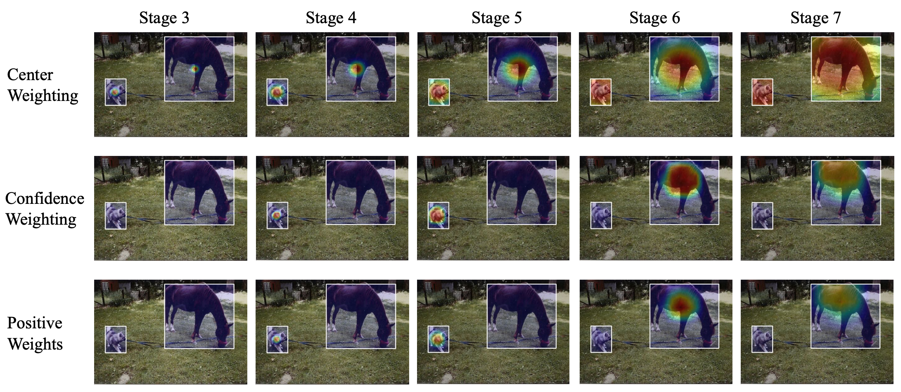

# Object Detection

## AutoAssign: Differentiable Label Assignment for Dense Object Detection

> Label-assignment, 选择正/负样本点(anchor-free)需要动态确定，且正负样本点损失加权。权重：cate+物体计算
>
> center prior: 训练时固定先验
>
> (instance) confidence map: 根据数据动态调整

之前空间上采样正负样本的方法为 1. IoU 2. 物体框中心固定区域都为正样本。但存在物体框中部分区域没有物体，且固定区域无法优化 *obstacle caused by feature shifting when backgrounds are sampled as positives may decrease the performance.*

提出根据category&instance信息动态产生pos/neg weight map [**differentiable/data-driven**]


👆更加dynamic


通过Center Weighting + Confidence Weighting得到Weight Map($w^+,w^-$)

#### Center Weighting

学习一个category-wise分布，即带参数的Gaussian-shape weighting function，用在FPN的每一层。

$G(\vec{d} \mid \vec{\mu}, \vec{\sigma})=e^{\frac{-(\vec{d}-\vec{\mu})^{2}}{2 \vec{\sigma}^{2}}}$，其中$\vec{d}$为某个位置的xy偏移量，一种类别有一组$\vec{\mu}\;\vec{\sigma}$

center prior可以<u>增加类别的先验分布信息</u>，防止网络冷启动后出现过拟合（不断优化第一次w高的点）

由于conf weighting作用的是<u>每个GT-Box中所有点</u>，所以应用center prior时已知类别

#### Confidence Weighting


增加Implicit-Objectness分支，抑制false-pos（框内部分点不在物体上）

训练时分类分支一起训练 $\mathcal{P}_{i}(\operatorname{cls}\mid\theta)=\mathcal{P}_{i}(\operatorname{cls}\mid obj, \theta) \mathcal{P}_{i}(\text {obj} \mid \theta)$

认为之前固定匹配模型的分类分支为<u>已知点是正样本</u>$\mathcal{P}_i(obj\mid\theta)=1$，预测点为某个类别的概率，即分类分支的结果为是$\mathcal{P}_i(cls|obj,\theta)$条件概率。$\mathcal{P}_i(cls\mid\theta)=\mathcal{P}_i(cls\mid obj,\theta)$, $\theta$是参数

现在改为Impl-Obj分支预测$\mathcal{P}_i(obj\mid\theta)$，再和分类分支$\mathcal{P}_{i}(cls\mid obj, \theta)$一起得到$\mathcal{P}_i(cls\mid\theta)$

且增加localization conf作为计算样本权重的依据，通过指数函数将定位准确率转为likelihood$\mathcal{P}_i(\theta)=\mathcal{P}_i(cls\mid\theta)\mathcal{e}^{-\lambda\mathcal{L}_i^{loc}(\theta)}$，在计算loss体现。类似*Learning From Noisy Anchors for One-Stage Object Detection* 综合考虑分类和定位的性能

$\begin{aligned} \mathcal{L}_{i}(\theta) &=\mathcal{L}_{i}^{c l s}(\theta)+\lambda \mathcal{L}_{i}^{l o c}(\theta) \\ &=-\log \left(\mathcal{P}_{i}(c l s \mid \theta)\right)+\lambda \mathcal{L}_{i}^{l o c}(\theta) \\ &=-\log \left(\mathcal{P}_{i}(c l s \mid \theta) e^{-\lambda \mathcal{L}_{i}^{l o c}(\theta)}\right) \\ &=-\log \left(\mathcal{P}_{i}(c l s \mid \theta) \mathcal{P}_{i}(loc \mid \theta)\right) \\ &=-\log \left(\mathcal{P}_{i}(\theta)\right) \end{aligned}$

joint conf representation $\mathcal{P}_i(\theta)$经过指数计算，增强$C\left(\mathcal{P}_{i}\right)=e^{\frac{\mathcal{P}_{i}(\theta)}{\tau}}$ （只会有一小部分落在物体上，得分高）

#### Weight Map

对一个**GT框内的点**计算权重，focus on proper loc inside bbox

融合，求正样本和负样本权重

$w_{i}^{+}=\frac{C\left(\mathcal{P}_{i}\right) G\left(\vec{d}_{i}\right)}{\sum_{j \in S_{n}} C\left(\mathcal{P}_{i}\right) G\left(\vec{d}_{i}\right)}$

$w_{i}^{-}=1-f\left(\frac{1}{1-\mathrm{i} \mathrm{ou}_{i}}\right)$，f normalize to [0,1]，<u>分数为sharpen权重分布</u>

Loss函数$\mathcal{L}(\theta)=-\sum_{n=1}^{N} \log \left(\sum_{i \in S_{n}} w_{i}^{+} \mathcal{P}_{i}^{+}\right)-\sum_{j \in S} \log \left(w_{j}^{-} \mathcal{P}_{j}^{-}\right)$

👆学习策略为一个box的训练，对一个box构建$w^+/w^-$训练

不同尺度热力图可视化👇



👇ImplicitObjectness抑制噪声效果显著


基于FCOS，提升2-3点，mAP=52.1%

---

## Towards Accurate One-Stage Object Detection with AP-Loss

> Label-assignment

正负样本不均衡问题 *It is observed that the classification metric could be very high for a trivial solution which predicts negative label for almost all candidate boxes, while the detection performance is poor*


负样本多，正样本分类结果对loss贡献少，对检测acc影响小

提出直接对AP(average precision)优化：AP Loss

<u>把分类分支问题看为一个rank问题，计算AP Loss，采用error-driven方式优化</u>

#### Ranking Task & AP Loss

因为计算AP过程实际是对预测结果排序，再计算，所以把分类问题看作一个ranking问题：对于每一类，所有的正样本点排在负样本点之前（更高分）

AP-Loss的primary term为：$(3)\;\;L_{i j}(\boldsymbol{x})=\frac{H\left(x_{i j}\right)}{1+\sum_{k \in \mathcal{P} \cup \mathcal{N}, k \neq i} H\left(x_{i k}\right)}=L_{i j}$ . 其中$x_{ij}$为两点的排序差距：$\forall i, j, \quad x_{i j}=-\left(s_{i}-s_{j}\right)$将分类预测的分数转化为排序x，作为损失函数的输入，H为Heaviside step function阶跃函数：$H(x)=\left\{\begin{array}{ll}0 & x<0 \\ 1 & x \geq 0\end{array}\right.$

即只有j排在i之前时，才对$L_{ij}$有贡献。GT定义为$\forall i, j, \quad y_{i j}=\mathbf{1}_{t_{i}=1, t_{j}=0}$

AP-Loss为：

$\mathcal{L}_{A P}=1-\mathrm{AP}=1-\frac{1}{|\mathcal{P}|} \sum_{i \in \mathcal{P}} \frac{\operatorname{rank}^{+}(i)}{\operatorname{rank}(i)}$ 
$=1-\frac{1}{|\mathcal{P}|} \sum_{i \in \mathcal{P}} \frac{1+\sum_{j \in \mathcal{P}, j \neq i} H\left(x_{i j}\right)}{1+\sum_{j \in \mathcal{P}, j \neq i} H\left(x_{i j}\right)+\sum_{j \in \mathcal{N}} H\left(x_{i j}\right)}=\frac{1}{\mathcal{P}}\left(\mathcal{P}-\sum_{i \in \mathcal{P}} \frac{1+\sum_{j \in \mathcal{P}, j \neq i} H\left(x_{i j}\right)}{1+\sum_{j \in \mathcal{P}, j \neq i} H\left(x_{i j}\right)+\sum_{j \in \mathcal{N}} H\left(x_{i j}\right)}\right)=\frac{1}{\mathcal{P}}\sum_{i\in\mathcal{P}}\frac{\sum_{j\in\mathcal{N}}H(x_{ij})}{1+\sum_{j\in\mathcal{P},j\neq i}H(x_{ij})+\sum_{j\in\mathcal{N}}H(x_{ij})}$

$=\frac{1}{|\mathcal{P}|} \sum_{i \in \mathcal{P}} \sum_{j \in \mathcal{N}} L_{i j}=\frac{1}{|\mathcal{P}|} \sum_{i, j} L_{i j} \cdot y_{i j}=\frac{1}{|\mathcal{P}|}\langle\boldsymbol{L}(\boldsymbol{x}), \boldsymbol{y}\rangle$ （由于只有i j分属正负时$L_{ij}$非0，同$y$的定义）

即为计算任意一个正样本P和一个负样本N的primary term。正样本之间没有，正负样本之间有损失

$\min _{\boldsymbol{\theta}} \mathcal{L}_{A P}(\boldsymbol{\theta})=1-\operatorname{AP}(\boldsymbol{\theta})=\frac{1}{|\mathcal{P}|}\langle\boldsymbol{L}(\boldsymbol{x}(\boldsymbol{\theta})), \boldsymbol{y}\rangle$

#### Error-driven Update

*the update is directly derived from the difference between desired output and current output*：$\Delta x_{i j}=L^*_{i,j}-L_{i j}$

最小化AP-Loss到0，即最佳优化方向$\Delta x_{i j}=-L_{i j} \cdot y_{i j}$，y控制是否对于loss有贡献

优化时，衡量改变参数$\theta$后x的变化与最佳优化方向之间的相似度，以及L2正则

$\arg \min _{\Delta \boldsymbol{\theta}}\left\{-\left\langle\Delta \boldsymbol{x}, \boldsymbol{x}\left(\boldsymbol{\theta}^{(n)}+\Delta \boldsymbol{\theta}\right)-\boldsymbol{x}\left(\boldsymbol{\theta}^{(n)}\right)\right\rangle+\lambda\|\Delta \boldsymbol{\theta}\|_{2}^{2}\right\}$，一阶泰勒展开算参数的优化方向

由于参数变化$\mathcal{\theta}^{(n+1)}-\mathcal{\theta}^{(n)}$在BP过程中不变，所以最佳优化方向$\Delta x_{ij}$即为x的梯度，链式求s的梯度

$(13)\;\;\begin{aligned} g_{i}&=-\sum_{j, k} \Delta x_{j k} \cdot \frac{\partial x_{j k}}{\partial s_{i}}=\sum_{j} \Delta x_{i j}-\sum_{j} \Delta x_{j i} \\ &=\sum_{j} L_{j i} \cdot y_{j i}-\sum_{j} L_{i j} \cdot y_{i j} \end{aligned}$


性能基于RetinaNet提升3个点

---

## DR Loss: Improving Object Detection by Distributional Ranking

> 基于AP-Loss，采用类似SVM方式对正负样本排序（margin）
>
> 增加对正负样本分布的改变 reweight


## Scale-Equalizing Pyramid Convolution for Object Detection (SEPC)

>采用3D卷积进行多尺度特征融合，不同层融合权重不同

特征金字塔不同层之间存在semantic gap，之前采用feature fusion解决但没有提取intrinsic property

**Pyramid Conv** `PConv`: **在尺度维上 (不同层特征图)** 做卷积（like spatial conv），3D conv

选择三层，底层采用stride卷积，中间普通卷积，上层bilinear upsampling。控制不同层的不同stride来获得相同大小的输出，并相加。时间成本为1.5倍


BN修改为整个特征金字塔层共享统计量，效果类似sync_bn，同步不同位置上的统计量，统计范围更广

BN = standardization($\mu$,$\sigma$) + scale_shift($\gamma$,$\beta$)，统计卷积的bn为每张特征图，即在channel维的统计（channel个统计量），**统计不同样本在同一个channel上所有wh点的**batch statistics $\mu$和$\sigma$（reduce at batch dimension）。每张特征图一对parameters $\gamma$和$\beta$ （https://zhuanlan.zhihu.com/p/43200897）

可以证明PConv能够提取Gaussian Pyramid(不同高斯模糊核对图片处理) 尺度不变的特征，即如果原图物体尺度变化，则可通过对PConv提取的特征shift得到改变后物体的特征 *<u>论文中有证明</u>*

**Scale-Equalizing Pyramid Conv** `SEPC`: PConv的升级版，通过deformable conv实现对不同尺度特征的对齐。

```python
def pconv_module_forward(x, conv2D_list):
	# x: input feature list [p3,p4,p5,p6,p7] # conv2D_list: conv2D module list,
	# [nn.Conv2D(stride=2),nn.Conv2D(),nn.Conv2D()]
	out_x = []
	for level in range(len(x)):
		tmp = conv2D_list[1](x[level])
		if level > 0:
			tmp += conv2D_list[0](x[level-1])
		if level < len(x) - 1:
			tmp += Upsample(conv2D_list[2](x[level+1])
		out_x.append(tmp) 
	return out_x
```

最底层普通卷积kernel size不变，其他层使用deformable conv


因为feature pyramid中由于backbone非线性操作，相对于gaussian pyramid特征不对齐，所以只通过dilation提取特征不全面，改用d-conv

*SEPC is an improved version of pconv, to relax the discrepancy of feature pyramid from a Gaussian pyramid by aligning the feature map of higher layers with the lowest layer*

底层特征采用普通卷积，卷积结果作为权重向上层的d-conv共享（卷积结果作为d-conv的一个输入求offset，类似CentripetalNet中）

SEPC模块用于取代RetinaNet的detection head的卷积模块

本质为一种pix-wise or fine-grained 的feature fusion，多尺度特征图通过卷积操作进行特征融合


性能提升明显


---

## PSConv: Squeezing Feature Pyramid into One Compact Poly-Scale Convolutional Layer

> 提取多尺度特征

一个卷积核不同通道不同dilation rate（不同颜色表示不同dilate）


$\mathcal{H}_{c, x, y}=\sum_{k=1}^{C_{i n}} \sum_{i=-\frac{K-1}{2}}^{\frac{K-1}{2}} \sum_{j=-\frac{K-1}{2}}^{\frac{K-1}{2}} \mathcal{G}_{c, k, i, j} \mathcal{F}_{k, x+i D_{(c, k)}, y+j D_{(c, k)}}$

扩张率在in通道上循环交替排布（👆T=4循环排列），在out通道维度上也循环排列


Fast RCNN替换backbone中所有卷积，FPN neck不变，提升2点左右

## Rethinking Classification and Localization for Object Detection (Double-Head RCNN)

> 检测头进行双路分支改进

二阶段检测器中，对proposal处理的传统检测头采用conv层，或者fast rcnn使用fc层处理


fc层作为head，由于全连接操作不同位置权重不共享，对于位置更加敏感（小位置变化大的输出结果变化），适合分类

conv层作为head，由于卷积操作不同位置权重共享，适合回归整个物体（coco2018结果表明可以使用conv层作为bbox的预测头）


分析conv作为head的分类回归结果👇


fc作为head的分类回归结果👆

1. 分类：fc作为head时，其高iou部分分类结果明显比conv作为head好。计算Pearson correlation coefficient👇fc-head的score-iou关系大于conv-head的score-iou关系


2. 定位：conv-head略好于fc-head

可视化关联关系：conv-head采用得到的特征图cos距离，7x7grid，每个点产生7x7大小的和其他任意点的关联矩阵；fc-head对fc层权重变换输出7x7特征图


conv-head计算的点和周围关联关系大

#### Double head RCNN

两个分支，conv-head用于回归，fc-head用于分类


改进：extend，训练时利用conv-head的分类损失和fc-head的回归损失进行监督(unfocused task supervision)

$\mathcal{L}^{f c}=\lambda^{f c} L_{c l s}^{f c}+\left(1-\lambda^{f c}\right) L_{r e g}^{f c}$, $\mathcal{L}^{c o n v}=\left(1-\lambda^{c o n v}\right) L_{c l s}^{c o n v}+\lambda^{c o n v} L_{r e g}^{c o n v}$

同时对分类分数进行二分支融合(classifiers are complimentary)


FPN+2.5~3.8 val AP

---

## D2Det: Towards High Quality Object Detection and Instance Segmentation

> 一阶段回归分支操作移植到二阶段
>
> deformable pooling + weighted pooling


#### Dense local regression

把RoI看作类似一阶段中的特征图。之前二阶段检测器对于一个RoI只预测一个框 (FC+预测)，改成RoI中每个点都预测一个框(dense prediction)。预测中间点到box上下左右的距离 (FCOS)

增加binary overlap prediction ($\hat{m}$)，对RoI和GT重叠部分为1，只有为1的点的预测结果有效。

<u>类似</u>一阶段中每点预测bbox，预测IoU/objectness

#### Discriminative RoI pooling

<u>deformable pooling + weighted pooling</u>

pooling的weighted权重通过输入特征操作得到（类似self-attention）👇W为计算的权重

$\tilde{F}=W(F) \odot F$

性能提升较明显: multi-scale 50.1

---

## NMS by Representative Region: Towards Crowded Pedestrian Detection by Proposal Pairing (PBM)

>基于bi-box regre. 根据vis框进行NMS

行人检测中重叠，类内重叠Replusion Loss和AggLoss惩罚两个人中间的box，但是box的重叠仍然会导致在NMS过程中被误删

Adaptive NMS中GT-density和Pred-density的inconsistency


GT框不密集，但Pred-box是密集的。Adaptive NMS预测GT的密集程度，而NMS和Pred的密集程度有关。👆预测绿框不密集，所以红框不会被保留

#### NMS by representative region

通过计算visible部分的IoU而不是full部分的IoU进行NMS

重叠不同物体的检测框full-IoU大，vis-IoU小。重叠同一物体full-IoU和vis-IoU都大 $\to$ vis-IoU判别


#### Paired BBox Faster RCNN

Paired RPN + Paired Proposal Feature Extractor +  Pair RCNN

##### Paired RPN

GT标注为pair Q=(F,V)，全身框和可见框

**从一个anchor**回归出full和visible的proposal（为了inherent correspondence）

anchor和一对GT标注的匹配标准：

$\operatorname{IoU}(\mathrm{A}, \mathrm{F}) \geq \alpha_{1}$ and $\operatorname{IoF}(\mathrm{A}, \mathrm{V}) \geq \beta_{1}$

$\operatorname{IoU}(\mathrm{A}, \mathrm{F})=\frac{\operatorname{Area}(\mathrm{A} \cap \mathrm{F})}{\operatorname{Area}(\mathrm{A} \cup \mathrm{F})},\;\;\operatorname{IoF}(\mathrm{A}, \mathrm{V})=\frac{\operatorname{Area}(\mathrm{A} \cap \mathrm{V})}{\operatorname{Area}(\mathrm{V})}$

full和vis的回归训练策略同bi-box regression

##### Paired Proposal Feature Extractor

融合full/vis两个proposal的特征


<font color="#00dd00">绿色分支</font>+<font color="dd0000">红色分支</font>：简单的concat两个proposal的特征向量

<font color="00dd00">绿色分支</font>+黑色分支：visible region attention/mask，构建visible部分的0/1 mask，与full特征$F_f$点乘得$F_m$，再concat $F_m$和$F_v$

##### Paired RCNN

融合特征和proposal作为输入，两个分支分别预测full和vis的检测框

proposal和一对GT的匹配标准：

$\operatorname{IoU}\left(\mathrm{P}_{\mathrm{f}}, \mathrm{F}\right) \geq \alpha_{2}$ and $\operatorname{IoU}\left(\mathrm{P}_{\mathrm{v}}, \mathrm{V}\right) \geq \beta_{2}$

性能提升明显


---

## Hit-Detector: Hierarchical Trinity Architecture Search for Object Detection

>NAS整体搜索，基于FBNet


二阶段检测器：backbone + neck(feature pyramid & fusing) + RPN(fixed) + Head

NATS和DetNAS搜索backbone，NAS-FPN搜FPN，Auto-FPN搜fusing和Head

单独搜索效果较差，采用整体每个部件(backbone: $\alpha$, neck: $\beta$, head: $\gamma$)一起搜索，**end-to-end search**

$\alpha^{*}, \beta^{*}, \gamma^{*}=\underset{\alpha, \beta, \gamma}{\arg \min } \mathcal{L}_{v a l}^{d e t}\left(\alpha, \beta, \gamma, w^{*}(\alpha, \beta, \gamma)\right)=\underset{\alpha, \beta, \gamma}{\arg \min } \mathcal{L}_{v a l}^{d e t}\left(\alpha, \beta, \gamma, \underset{w}{\arg \min } \mathcal{L}_{t r a i n}^{d e t}(\alpha, \beta, \gamma, w)\right)$

每个component采用逐层搜索，构建每个操作用在每一层的得分矩阵$\alpha$，选择概率

对一个操作用在不同层的得分进行L2**正则化(column-space regularization)**，减少得分的数值大小：

$\min _{\alpha} f(\alpha)+\mu \min _{i}(\sqrt{\sum_{l=1}^{L} \alpha_{l, i}^{2}})$

选择$\alpha_{l,i}$最大max的一个操作，但为了可微采用softmax来选择(continuous relaxation)

搜索backbone时搜索空间的节点计算(differentiable)：$x_{l}=\sum_{o \in \mathcal{O}_{b}} \frac{\exp \left(\alpha_{l}^{o}\right)}{\sum_{o^{\prime} \in \mathcal{O}_{b}} \exp \left(\alpha_{l}^{o^{\prime}}\right)} o\left(x_{l-1}\right)$

搜索neck时搜lateral connection，搜索Head时搜fc预测前的block

优化时增加FLOPS约束：$\mathrm{C}(\alpha)=\sum_{l} \sum_{o \in \mathcal{O}_{b}} \alpha_{l}^{o} \mathrm{FLOPs}(o, l)$

首先固定$\{\alpha,\beta,\gamma\}$在一半的数据上训练求$\partial \mathcal{L}/\partial \mathcal{w}$更新$w$，再固定$w$在剩下的数据上训练求$\partial\mathcal{L}/\partial\alpha,\partial\mathcal{L}/\partial\beta,\partial\mathcal{L}/\partial\gamma$更新架构$\alpha,\beta,\gamma$

---

## SaccadeNet: A Fast and Accurate Object Detector


<u>Center Attentive Module</u>产生中心点和类别；<u>Attention Transitive Module</u>产生wh；<u>Aggregation Attentive Module</u>融合两分支的特征（双线性插值）和预测，并对预测框进行refine；<u>Corner Attentive Module</u>只有一个block产生角点预测，用于backbone监督信号，测试时去掉。

相比CenterNet改进：1. 通过Aggregation进行二步refine 2. 增加corner分支的监督信号有助于对边缘的检测（帮助预测wh的分支） 3. L1作为box训练损失


👆<u>test-dev</u>上性能，速度提升明显，快于yolov3

---

## Learning from Noisy Anchors for One-stage Object Detection

> loss函数增加权重，选择回归分类分数高的框增大其loss贡献
>
> 对loss学习时的修改

之前的检测器评价anchor好坏使用IoU，harsh的划分导致噪声和不易训练


拖车：IoU大但包含其他物体；长颈鹿：包含关键特征但IoU小

以IoU作为正负样本划分会导致噪声，需要根据<u>回归分类结果(cleanliness)</u>划分

**分类上**采用对cleanliness的预测代替之前根据IoU的pos/neg的0/1预测，RPN的**soft-label**，<u>类似IoU-Net的预测IoU/soft-objectness</u>

$c=\left\{\begin{array}{ll}\alpha \cdot \text{loc_acc}+(1-\alpha) \cdot \text { cls_conf } & \text { for } b \in \mathcal{A}_{p o s} \\ 0 & \text { for } b \in \mathcal{A}_{n e g}\end{array}\right.$

对按IoU划分的$\mathcal{A}_{pos}$中部分较高IoU的anchor计算cleanliness，即回归分类的性能

稳定训练，前几个iter采用anchor-gt的IoU而不是预测结果的IoU计算c

$L_{c l s} =\sum_{i}^{\mathcal{A}_{p o s}} r_{i} \operatorname{BCE}\left(p_{i}, c_{i}\right)+\sum_{j}^{\mathcal{A}_{n e g}} \operatorname{BCE}\left(p_{j}, c_{j}\right)$，用于RPN或objectness预测

**定位上**采用根据c**对$\mathcal{A}_{pos}$中**anchor计算**reweight** r，对anchor回归<u>损失加权</u>。$\operatorname{loc\_a}$为box和**匹配到的**GT的IoU（匹配用最大IoU方法）

$r=\left(\alpha \cdot f\left(\text{loc_a}\right)+(1-\alpha) \cdot f\left(\text{loc_c}\right)\right)^{\gamma}$，其中$f(x)=\frac{1}{1-x},\;\gamma=1$，为增大variance，并将$r$均值正则化到1

$ L_{r e g} =\sum_{i}^{\mathcal{A}_{p o s}} r_{i} \operatorname{smooth}_{-} \ell_{1}$


---

## CSPNet: A New Backbone that can Enhance Learning Capability of CNN

> 使用卷积层截断梯度，减少直接相连，防止梯度重复计算

densenet中不断的concat会让梯度反传时后面的梯度不断传到前面，计算量大，重复计算

$\begin{aligned} x_{1} &=w_{1} * x_{0} \\ x_{2} &=w_{2} *\left[x_{0}, x_{1}\right] \\ & \vdots \\ x_{k} &=w_{k} *\left[x_{0}, x_{1}, \ldots, x_{k-1}\right] \end{aligned}$

反传

$\begin{aligned} w_{1}^{\prime} &=f_{1}\left(w_{1}, \left\{ g_{0}\right\}\right) \\ w_{2}^{\prime} &=f_{2}\left(w_{2},\left\{g_{0}, g_{1}\right\}\right) \\ w_{k}^{\prime} &=f_{k}\left(w_{k},\left\{g_{0},g_{1}, \ldots, g_{k-1}\right\}\right) \end{aligned}$

例如在最后一层计算过程中，由于和前面层直接连接，梯度会一直回传到w1

提出：**Partial Dense Block** 输入特征channel上分为两部分$\left[x_0^\prime,\;x_0^{\prime\prime}\right]$，一部分直接相连，另外部分dense block。**Partial Transition Layer** 融合时采用transition层截断梯度的传播


$\begin{aligned} x_{k} &=w_{k} *\left[x_{0}^{\prime\prime}, x_{1}, \ldots, x_{k-1}\right] \\ x_{T} &=w_{T} *\left[x_{0}^{\prime\prime}, x_{1}, \ldots, x_{k}\right] \\ x_{U} &=w_{U} *\left[x_{0}^{\prime}, x_{T}\right] \\ w_{k}^{\prime} &=f_{k}\left(w_{k},\left\{g_{0}^{\prime \prime}, g_{1}, \ldots, g_{k-1}\right\}\right) \\ w_{T}^{\prime} &=f_{T}\left(w_{T},\left\{g_{0}^{\prime \prime}, g_{1}, \ldots, g_{k}\right\}\right) \\ w_{U}^{\prime} &=f_{U}\left(w_{U},\left\{g_{0}^\prime, g_{T}\right\}\right) \end{aligned}$

$w_{U}$的梯度只传递到$w_T$，之后梯度全部从$w_T$开始传


Fusion first能截断更多梯度传递（如后续部分到part1的梯度），但性能较差；采用fusion last

提出EFM，临近层特征融合，防止distract


检测任务性能提升明显

---

## Feature Pyramid Transformer

> 采用transformer/self-attention方式进行多尺度特征融合/交互

Non-local只对同一尺度的不同空间特征交互，改进space+scale


不同层的不同空间位置的物体interaction（co-occurring in multiple scales）

#### Non-local

用于一张特征图不同位置特征。看作self-attention，输入$\mathbf{q}_i=f_q(\mathbf{X}_i)$表示$i$位置<u>经过$f_q$提取后</u>的query，$\mathbf{k}_j=f_k(\mathbf{X}_j)$为key，$\mathbf{v}_j=f_v(\mathbf{X}_j)$为$j$位置的value

先dot product计算i-query和j-key相似度，softmax标准化得到权重，和j-value相乘的到结果

$\begin{aligned} \text { Input: } & \mathbf{q}_{i}, \mathbf{k}_{j}, \mathbf{v}_{j} \\ \text { Similarity: } & s_{i, j}=F_{\text {sim}}\left(\mathbf{q}_{i}, \mathbf{k}_{j}\right) \\ \text { Weight: } & w_{i, j}=F_{\text {nom}}\left(s_{i, j}\right) \\ \text { Output: } & \tilde{\mathbf{X}}_{i}=F_{\text {mul}}\left(w_{i, j}, \mathbf{v}_{j}\right), \end{aligned}$

#### Self-Transformer (ST)

用于一张图上co-occurring物体特征。把query和key分成$N$份，每部分计算相似度$s_{i, j}^{n}=F_{s i m}\left(\mathbf{q}_{i, n}, \mathbf{k}_{j, n}\right)$，使用Mixture of Softmax作为标准化函数（加权求和$\pi_n$）

$w_{i,j} = F_{\operatorname{mos}}(s_{i, j}^{n})=\sum_{n=1}^{\mathcal{N}} \pi_{n} \frac{\exp (s_{i, j}^{n})}{\sum_{j} \exp (s_{i, j}^{n})}$


#### Grounding Transformer (GT)

top-down融合，ground高层concept特征到低层pixel特征，高层$k\;v$低层$q$

采用负欧式距离计算不同层之间特征相似度 $F_{\text {eud}}\left(\mathbf{q}_{i}, \mathbf{k}_{j}\right)=-\left\|\mathbf{q}_{i}-\mathbf{k}_{j}\right\|^{2}$

$\mathbf{q}_i=f_q(\mathbf{X}_i^f)$表示$f$层$i$位置的特征，$\mathbf{k}_j=f_K(\mathbf{X}_j^c)$表示$c$层$j$位置，计算的到$\mathbf{\hat{X}}_i^f$

分割任务需要局部信息，传统采用直接相加，而用GT会带来全局信息，提出**Locality-constrained Grounding Transformer**，$\mathbf{q}_i$只和一部分$\mathbf{k}_j\;\mathbf{v}_j$交互


#### Rendering Transformer (RT)

bottom-up, rendering high-level concept with low-level pixels

低层的$\mathbf{K}$和$\mathbf{V}$，高层为$\mathbf{Q}$

 $\mathbf{K}$首先GAP计算为权重$\mathbf{w}$，权重$\mathbf{w}$再和$\mathbf{Q}$相乘refine，最后和downsample (conv+stride)的$\mathbf{V}$相加

$\begin{aligned} \text { Input: } & \mathbf{Q}, \mathbf{K}, \mathbf{V} \\ \text { Weight: } & \mathbf{w}=G A P(\mathbf{K}) \\ \text { Weight Query: } & \mathbf{Q}_{a t t}=F_{a t t}(\mathbf{Q}, \mathbf{w}) \\
\text{Down-sampled Value: } & \mathbf{V}_{d o w}=F_{sconv}(\mathbf{V})\\
\text{Output: } & \hat{\mathbf{X}}^{c}=F_{a d d}\left(F_{\text {conv }}\left(\mathbf{Q}_{a t t}\right), \mathbf{V}_{\text {dow}}\right)\end{aligned}$

#### 总体架构

resnet，faster rcnn head


高层计算用于GT的特征，低层计算用于RT的特征，transformer融合的到新特征，concat

参数量，计算量增加大

---

## BorderDet: Border Feature for Dense Object Detection

> explicit border information


borderdet增强了边缘的特征

#### Border Align

原始特征通道数为C，构建5C通道的特征，表示上下左右特征和原始点的特征。输入coarse box reg的bbox。

对于每个ij点，4C分别选择其对应预测框的边上响应最大的特征作为这个点的输出特征（+原始特征=5C x W x H特征图）

$F_{c}(i, j)=\left\{\begin{array}{ll}I_{c}(i, j) & 0 \leq c<C \\ \max _{0 \leq k \leq N-1}\left(I_{c}\left(x_{0}, y_{0}+\frac{k h}{N}\right)\right) & C \leq c<2 C \\ \max _{0 \leq k \leq N-1}\left(I_{c}\left(x_{0}+\frac{k w}{N}, y_{0}\right)\right) & 2 C \leq c<3 C \\ \max _{0 \leq k \leq N-1}\left(I_{c}\left(x_{1}, y_{0}+\frac{k h}{N}\right)\right) & 3 C \leq c<4 C \\ \max _{0 \leq k \leq N-1}\left(I_{c}\left(x_{0}+\frac{k w}{N}, y_{1}\right)\right) & 4 C \leq c<5 C\end{array}\right.$

$(i,j)$的coarse预测结果为$(x_0,y_0,x_1,y_1)$


**Border Alignment Module**对特征升维，BorderAlign，降维👇


BorderDet分别在定位和分类分支使用BAM，BAM使用定位分支的第一步的定位结果，再去refine，组合成为最后输出👇


---

## SpineNet: Learning Scale-Permuted Backbone for Recognition and Localization

> NAS+检测，encoder+decoder结构不好 (scale decreased model)
>
> 尺度增大减小，不同尺度特征连接

提出scale-permuted model，保证：1. 特征图尺度可以随时增大减小 2. 不同尺度的特征可以连接进行融合

直接搜索整个网络，而不是分别搜索backbone和fpn


逐步替换resnet👇，红色为输出层，可以看作**backbone+FPN**


Multi-scale, DropBlock, stochastic depth, swish activation

性能提升明显 mAP=52.1

---

## Dually Supervised Feature Pyramid for Object Detection and Segmentation

> FPN top-down和botton-up两次都预测监督算loss
>
> 拆分cls和reg head

1. 

2. 

---

## Pyramidal Convolution: Rethinking Convolutional Neural Networks for Visual Recognition

> 一个卷积拆分为多个不同receptive field的分组卷积


Bottom-up: 感受野逐渐增大，kernel深度$FM_{out-i}$逐渐减小

kernel depth (输出通道数): $\left\{F M_{i}, \frac{F M_{i}}{\left(\frac{K_{2}^{2}}{K_{1}^{2}}\right)}, \frac{F M_{i}}{\left(\frac{K_{3}^{2}}{K_{1}^{2}}\right)}, \ldots, \frac{F M_{i}}{\left(\frac{K_{n}^{2}}{K_{1}^2}\right)}\right\}$

对SSD模型有提升

---

## Generalized Focal Loss: Learning Qualified and Distributed Bounding Boxes for Dense Object Detection

> 

1. 训练时cls-score和iou/objectness-score单独预测但测试时直接相乘
2. bbox没有建模uncertainty

#### QFL


👆IoU(quality)和cls-score不match，👇独立预测


👆传统为冲击函数(Dirac delta dist.)，无法建模不确定性

提出预测分类-质量联合表示（smooth label），离散label，将Focal Loss的优化改 $\mathbf{Q F L}(\sigma)=-|y-\sigma|^{\beta}((1-y) \log (1-\sigma)+y \log (\sigma))$ 「展开pos+neg」

#### DFL


👆之前是冲击函数，只有标注y出概率最大，其他为0，对于不确定的边界没有监督


👆不确定边界 bottom，双峰


传统 $\hat{y}=\int_{-\infty}^{+\infty} \delta(x-y) x \mathrm{d} x$，冲击函数，只预测一点

提出通过分布$P$预测label $\hat{y}=\int_{-\infty}^{+\infty} P(x) x \mathrm{d} x=\int_{y_{0}}^{y_{n}} P(x) x \mathrm{d} x$ 分布的积分

从冲击函数，到先验高斯分布，到任意分布，建模**随机性**


离散化 $\hat{y}=\sum_{i=0}^{n} P\left(y_{i}\right) y_{i}$，$\sum_{i=0}^nP(y_i)=1$

减少计算量，真实分布与标注位置距离不会太远，只计算左右最近两个$y_l,\;y_r$

$\hat{y}=\sum_{j=0}^{n} P\left(y_{j}\right) y_{j}=\mathcal{S}_{i} y_{i}+\mathcal{S}_{i+1} y_{i+1}=\frac{y_{i+1}-y}{y_{i+1}-y_{i}} y_{i}+\frac{y-y_{i}}{y_{i+1}-y_{i}} y_{i+1}$

$\mathbf{D F L}\left(\mathcal{S}_{i}, \mathcal{S}_{i+1}\right)=-\left(\left(y_{i+1}-y\right) \log \left(\mathcal{S}_{i}\right)+\left(y-y_{i}\right) \log \left(\mathcal{S}_{i+1}\right)\right)$

最后预测为左右最近两个位置的线性组合 $\hat{y}=y_l*p_{y_l}+y_r*p_{y_r}\;\left(p_{y_l}+p_{y_r}=1\right)$

#### GFL

QFL和DFL的统一表示 Generalized Focal Loss

$\mathbf{G F L}\left(p_{y_{l}}, p_{y_{r}}\right)=-\left|y-\left(y_{l} p_{y_{l}}+y_{r} p_{y_{r}}\right)\right|^{\beta}\left(\left(y_{r}-y\right) \log \left(p_{y_{l}}\right)+\left(y-y_{l}\right) \log \left(p_{y_{r}}\right)\right)$

训练损失

$\mathcal{L}=\frac{1}{N_{p o s}} \sum_{z} \mathcal{L}_{\mathcal{QFL}}+\frac{1}{N_{p o s}} \sum_{z} \mathbf{1}_{\left\{c_{z}^{*}>0\right\}}\left(\lambda_{0} \mathcal{L}_{\mathcal{Bbox}}+\lambda_{1} \mathcal{L}_{\mathcal{DFL}}\right)$

对所有位置$z$计算QFL，对正样本$c^*_z>0$计算GIoU loss和DFL

DFL和IoU-loss优化bbox回归，分别建模uncertainty和IoU最大；QFL优化分类分支

对大目标提升效果好，+1 mAP

Ref: https://zhuanlan.zhihu.com/p/147691786

---

