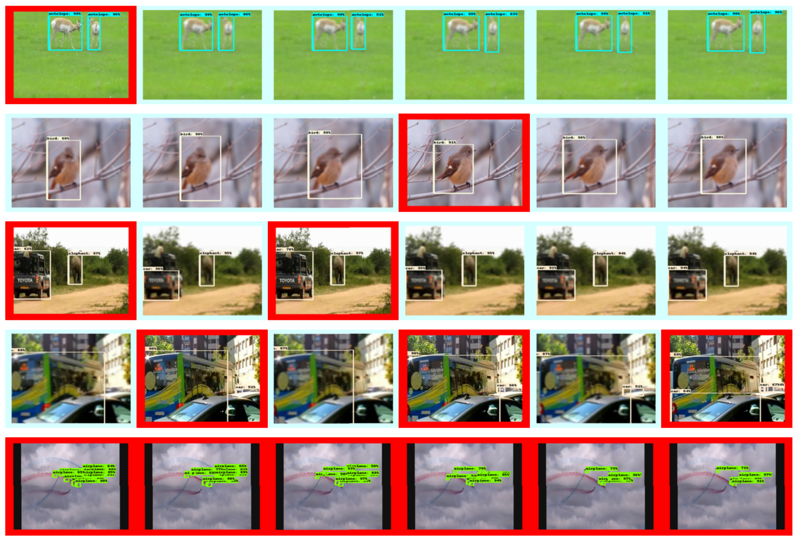

# Video Object Detection

> All I know about video det&track.
> These two topics are **NOT** identical. 
> Feature extraction based 🆚 Metrics learning based

##  Trendings

<u>**LSTM**</u> 
mostly used in video **understanding**, eg: video abnormal detection, event recognization, find content…
Extract global action & scene information

<u>**Detect+Track**</u>
> How to leverage temporal information?

Tracking: 提模版特征，特征图匹配，找
Detection in video: 

1. frame by frame

2. 使用temporal information作为<u>**类别**</u>判断的依据
   使用LSTM传递时间信息（**any context information?**）

3. 使用temporal预测可能出现的位置，<u>**不确定性**</u>
   Fuse 检测位置+预测位置 with uncertainty 
   Multi hypothesis tracking

<u>Detect to Track and Track to Detect Papers:</u>

*Detect to Track and Track to Detect* https://github.com/feichtenhofer/Detect-Track
*Integrated Object Detection and Tracking with Tracklet-Conditioned Detection*

<u>**video object segmentation**</u> hot topic.    **datasets**: youtube-VOS, DAVIS

1. _Spatiotemporal CNN for Video Object Segmentation_ use **LSTM**, two branch, **attention mechanism**
2. _See More, Know More: Unsupervised Video Object Segmentation With Co-Attention Siamese Networks_  apply **co-attention**
3. _Fast User-Guided Video Object Segmentation by Interaction-And-Propagation Networks_
4. _RVOS: End-To-End Recurrent Network for Video Object Segmentation_
5. _BubbleNets: Learning to Select the Guidance Frame in Video Object Segmentation by Deep Sorting Frames_        does not have to be **first** frame, and **select** the best frame in the training sets, **ranking frame** mechanism
6. _FEELVOS: Fast End-To-End Embedding Learning for Video Object Segmentation_    use **pixel-wise embedding** and global&local **matching** mechanism to **transfer** the information from first and previous to current frame
7. _Object Discovery in Videos as Foreground Motion Clustering_    model the VOS problem as foreground motion clustering, **cluster foreground pixel into different object**. Use RNN to learn embedding of fore-pixel trajectory, add correspondence of pixels in frames.
8. MHP-VOS: Multiple Hypotheses Propagation for Video Object Segmentation_    **multiple hypothesis tracking**

<u>**Re-ID in video**</u> 
_Attribute-Driven Feature Disentangling and Temporal Aggregation for Video Person Re-Identification_        **attribute**-driven feature disentangling & frame **re-weighting**
_VRSTC: Occlusion-Free Video Person Re-Identification_    use temporal information to **recover** occluded frame

<u>**fusion**</u> spatial and temporal feature, using **weighted sum**, optical flow
_Accel: A Corrective Fusion Network for Efficient Semantic Segmentation on Video_

<u>**unsupervised manner**</u> add other training signal

<u>**weakly-supervised manner**</u> use motion and video clue to generate more precise **proposals**.
_You Reap What You Sow: Using Videos to Generate High Precision Object Proposals for Weakly-Supervised Object Detection_ 

<u>**graph convolution network**</u> perform temporal reasoning

<u>**downsampling**</u> is sometimes beneficial in terms of accuracy. By means of 1) reducing unnecessary details    2) resize the too-large objects and increase confidence _Adascale: Towards Real-time video object detection using adaptive scaling_ 

<u>**utilize temporal information**</u> 1. **wrap** temporal info with feature to generate future feature     2. for partial **occlusion**, motion **blur** in video

<u>**iteratively refine**</u> 
_STEP: Spatio-Temporal Progressive Learning for Video Action Detection_
refine the proposal to action, step by step. Spatial-temporal: spatial displacement + action tube(temporal info)

## Datasets

1. ImageNet VID: [ILSVRC2017](http://image-net.org/challenges/LSVRC/2017/#vid)
   30 categories
   2015:
   _train_     1952 snippets, 405014 (186358+218656) images
   _test_     458 snippets, 127618 images
   _val_     281 snippets, 64698 images
   2017:
   _train_     3862 snippets, 1122397 images
   _test_     937 snippets, 315176 images
   _val_     555 snippets, 176126 images
2. Youtube-BB
   5.6M bounding boxes
   240k snippets    (380k in paper, about 19s long)
   23 categories, _NONE_ category for unseen category 
   Annotate video with 1 frame per second
3. UA-DETRAC
4. UAVDT
5. MOT challenge (Design for MOT)
- - - -

## SOTAs       
_Integrated Object Detection and Tracking with Tracklet-Conditioned Detection_
 [Tracklet-Conditioned Detection+DCNv2+FGFA](https://paperswithcode.com/paper/integrated-object-detection-and-tracking-with) 
mAP=83.5 

Integrate tracking in detection not post processing
Compute **embeddings** of tracking trajectory with detection box, embeddings-weighted **sum** trajectory category **confidence** with detect category confidence. 

Weight = f(embeddings)
Update trajectory confidence with new + old
Class confidence = trajectory confidence + det confidence
Output = weighted-sum(weights*Class confidence)

**Category(only)** is determined jointly weighted by last trajectory category and detect box category

<u>**code**</u> released [Flow-Guided Feature Aggregation for Video Object Detection](https://paperswithcode.com/paper/flow-guided-feature-aggregation-for-video) 
mAP=80.1, 2017
code released

## Thinkings

1. <u>**No keyframe**</u>  use LSTM to **directly** generate detection result
   Input image -> **every frame**, LSTM to hidden layer and output bbox.
2. <u>**Keyframe**</u>  select only keyframe for deep and warp to generate interval frame’s feature map (based on **optical flow**)
   👆 How to get feature map with low cost

- - - -

👇 How to get box with previous information 

3. <u>**Tracking based**<u>  detect by tracking and tracking by detect

#### Detection and Tracking

做video detection $\to$ 避开tracking：物体不动，分类，3D框，使用LSTM特征传播（一帧效果差，多帧序列变好）
静态图片detection

> Why temporal information is not leveraged in tracking?  

难点：帧间信息，temporal信息的高效传递
传递清晰信息，防止<u>**motion blur**</u>
<u>**tubelet**</u>

## Topics in Workshop

-- **Large scale** surveillance video: [GigaVision](http://gigavision.cn/)

— Autonomous driving: [Workshop on autonomous driving](http://wad.ai/2019/challenge.html) <u>**3D bounding box**</u> Baidu Apollos

— **Aerial** image (remote sensor): [Detecting Objects in Aerial Images (DOAI)](https://captain-whu.github.io/DOAI2019/cfp.html)
难点：1. Scale variance    2. Small object densely distributed        3. Arbitrary orientation 

— **UAV**ision:  [https://sites.google.com/site/uavision2019/home](https://sites.google.com/site/uavision2019/home) <u>**UAV**</u>     1920x1080, 15m, 2min, _no classification_

— **MOT**: [BMTT MOTChallenge 2019](https://motchallenge.net/workshops/bmtt2019/index.html)

— **ReId**, Multi-target multi-camera tracking: [Target Re-identification and Multi-Target Multi-Camera Tracking](https://reid-mct.github.io/2019/)

— **Autonomous driving**: [https://sites.google.com/view/wad2019/challenge](https://sites.google.com/view/wad2019/challenge) 
D2-city: 10k video, 1k for tracking, HD
BDD100k: 100k video, nano on keyframe, 40s, 720p 30fps [You Can Now Download the World’s Largest Self-Driving Dataset](https://interestingengineering.com/you-can-now-download-the-worlds-largest-self-driving-dataset)
nuScenes: 1.4M frames, <u>**3D box annotation**</u>
Other autonomous driving datasets: Oxford Robotcar, TorontoCity, KITTI, _Apollo Scape_ (1M), _Waymo Open Dataset_ (16.7h, 600k frame, 22m 2D-bbox)  [https://scale.com/open-datasets](https://scale.com/open-datasets) 

## Papers at ECCV18 

**Temporal information for Classifying** _Multi-Fiber Networks for Video Recognization (ECCV18)_
**All** _Fully Motion-Aware Network for Video Object Detection_
_Video Object Detection with an Aligned Spatial-Temporal Memory_
**Hard example mining** _Unsupervised Hard Example Mining from Videos for Improved Object Detection_
**Sampling?** _Object Detection in Video with Spatiotemporal Sampling Networks_
_3D Tracking & Trajectory_ _3D Vehicle Trajectory Reconstruction in Monocular Video Data Using Environment Structure Constraints_

> RCNN -> Fast RCNN: 使用RoI pooling代替resize，只计算一次特征图(RoI projection)，多任务训练(bbox regre.和classif.一起训练)  
> Fast RCNN -> Faster RCNN: 使用RPN代替selective search  

一阶段相比二阶段少了RoI pooling过程，拿到框直接在整张图的特征图上分类回归，而不在框中进行。导致可能特征偏移问题

- - - -

# Papers 

## Object Detection in Video with Saptiotemporal Sampling Networks

> 使用类似FGFA的方法，但是增加deformable卷积，简化求其他帧feature和权重的步骤

#### Motivation

去掉训练中需要的光流数据，提升（训练）速度

#### Approach

**Deformable Convolution**: 通过数据计算出的偏移量，是卷积的receptive field可变。不只是基于中心的`{(-1,-1),(-1,0),(-1,1),...,(1,0),(1,1)}`，即$p_0+p_n$，而可以是$p_0+p_n+\Delta p_n$。其中$\Delta p_n$为小数，使用双线性插值计算。

**Spatiotemporal Sampling Network**

选择前后K帧的特征图进行融合，当前帧reference frame，其他帧supporting frame。

1. 求特征时进行四次**变形卷积**

$f_t=Backbone(I_t),\; f_{t+k}=Backbone(I_{t+k}),\; f_{t,t+k}=concat(f_t, f_{t+k}) $

$o^{(1)}_{t,t+k}=predict\_offset(f_{t,t+k})$

$g^{(1)}_{t,t+k}=deform\_conv(f_{t,t+k},\; o^{(1)}_{t,t+k}) $

$o^{(2)}_{t,t+k}=predict\_offset(g^{(1)}_{t,t+k}) $

$g^{(2)}_{t,t+k}=deform\_conv(g^{(1)}_{t,t+k},\; o^{(2)}_{t,t+k})$

And so on...

但最后一次，使用最初的

$g^{(4)}_{t,t+k}=deform\_conv(o^{(4)}_{t,t+k},\; f_{t,t+k})$

2. 融合时，将前后K帧进行融合。

计算第`t+k`帧权重：

三层子网络S对g计算中间表示，求余弦距离的exp来计算权值。对前后的每一张support frame的每一个像素p计算融合权重

$w_{t,t+k}(p)=exp(\frac{S(g^{(4)}_{t,t})(p)\cdot S(g^{(4)}_{t,t+k})(p)}{|S(g^{(4)}_{t,t})(p)|\;|S(g^{(4)}_{t,t+k})(p)|})$

归一化后融合，在t-K到t+K的时间范围上加权求和，获得每个像素点在reference frame（t时刻）的融合特征，输入检测网络。

**细节**

- backbone采用增加4个$3\times 3$变形卷积的ResNet-101网络。

- 获得融合特征$g^{aggr.}_t$后，拆成两部分，一半输入RPN产生proposal（每点9个anchor和一共300个proposal），另一半输入R-FCN。

- 训练时K较小，K=1，前后各一帧，随机sample的。

- 先在DET上预训练，support frame就是本身。

- 测试时使用较大K，K=13。先算出特征图然后缓存来解决GPU RAM问题。

---

## Looking Fast and Slow: Memory-Guided Mobile Video Object Detection

> Using memory(LSTM) in object detection
> 
> SOTA of ImageNet VID

Concern more on light-weight and low computation time.

使用轻量级网络mobilenet识别场景的主要内容，快速的特征提取需要维护memory作为补充信息

一个精确的特征提取器用于初始化和维护memory，之后快速处理，使用LSTM维护memory。强化学习用来决定使用快速/慢速特征提取器(tradeoff)

---

#### 多分支特征提取

Use two feature extractor **parallel** (accuracy🆚speed)

inference流程

$M_k, s_k = \bold{m}(\bold{f_i}(I_k), s_{k-1})$

$D_k=\bold{d}(M_k)$

$\bold{f_i}$为选择的特征提取网络，**m**为memory module.

$\bold{f_i}=\{f_0: MobileNetV2 \to accuracy,\;\; f_1: low\; reso \& depth \to speed\}$，**d**为SSD检测网络

定义$\tau$为$f_1:f_0$超参数，也可以通过interleaving policy获得

**other methods**：减少深度0.35，降低分辨率160x160，SSDLite，限制anchor的长宽比$\{1,\;0.5,\;2.0\}$

#### memory module

Modified LSTM module👆: 

1. **skip connection** between the bottleneck and output
2. **grouped convolution** process LSTM state groups separately

*Ps. standard LSTM*👇

To perserve **long-term dependencies** $\to$ *skip state update*: when $f_1$ run, always **reuse output state** from the last time $f_0$ was run

#### Training

Pretrain LSTM on Imagenet Cls for initialization

Unroll LSTM to six steps

Random select feature extractor

Crop and shift to augment training data

---

#### Adaptive Interleaving Policy(RL)

Policy network $\pi$ to measure detection confidence, examines **LSTM state** and decide next feature extractor to run

Train policy network using Double Q-learning(DDQN)

Action space: $f_i$ at next step

State space: $S=(c_t,\;h_t,\;c_t-c_{t-1},\;h_t-h_{t-1},\;\eta_t)$, LSTM states and their changes, action history term $\eta$ (binary vector, len=20).

Reward space: **speed reward** positive reward when $f_1$ is run, **accuracy reward** loss difference between min-loss extractor.

Policy network to devide which extractor👇

Generate batches of $(S_t,\;a,\;S_{t+1},\;R_t)$ by run interleaved network in inference mode

Training process👇

---

#### Inference Optimization

1. Asynchronous mode

$f_0$ and $f_1$ run in separate threads,  $f_1$ keeps detection and  $f_0$ **updates memory when finished** its computation. Memory module use most recent available memory, **NO WAIT** for slow extractor.

**Potential Weakness**: latency/mismatch of call large extractor and accuracy memory output. Delay of generate more powerful memory using large extractor when encounter hard example. Memory will remains less powerful before large extractor generates new one.

2. Quantization

---

#### Experiments

ImageNet VID val👆

👆RL demonstration: red means call large model, blue for small model.

---

## Object detection in videos with Tubelet Proposal Networks

> 如何高效的产生时间维度的proposal (aka. ::tubelet::)?  
> 通过关键帧检测结果产生一条序列的所有proposal ::detect by track::。然后使用LSTM分类  

产生tubelet有两种方法 1. Motion-based (only for short-term)    2. Appearance-based (tracking, expensive/?)

#### Approach

↖️首先对静态图片进行检测获得检测结果，然后在 **相同位置** 不同时间上pooling，获得spatial anchors。基于假设感受野足够大可以获得运动物体的特征（中心不会移出物体框）。Align之后用于预测物体的移动

使用Tubelet Proposal Network回归网络预测相对于 **第一帧** 的运动量（为了防止追踪过程中的drift，累计误差）。预测的时间序列长度为omega

同时，认为GT的bbox就是tubelet proposal的监督信号。同时对运动表示进行归一化。（对归一化后的残量进行学习）

损失函数👇

👆M为GT，M_hat为归一化后的offset

创新点：::分块初始化::
首先训练预测时间序列长度为2的TPN，得到参数W_2和b_2。由于第二帧运动量m_2由第1和第2帧的特征图预测，第三帧运动量由第1和第3帧特征图预测，m_4由第1&4帧预测。和中间帧无关，所以认为预测过程有相似性（1&2 -> m2, 1&3 -> m3)，可以使用W_2和b_2部分初始化W_3和b_3参数中的一块👇

最后循环产生所有帧的所有static anchor的tubelet proposal👇

LSTM做类别预测↘️

↗️RoI-pooling之后的tubelet proposal中特征放入一层的LSTM encoder，再将memory和hidden放入decoder反序输出类别预测

- - - -

## IoU tracker

`D`表示检测结果，`F`帧，每一帧至多`N`个检测结果
`T_a`表示正在追踪未结束的目标，`T_f`表示已经最终完成的trajectory（移出画面外）
**思路**：
对于 _某一帧_ ，对于每个正在追踪的 _trajectory_ ，在当前帧的检测结果中找IoU最大的检测结果。如果IoU大于阈值，添加到检测结果中；如果最大的IoU都没有大于阈值，则判断trajectory的长度和最高置信度，判断是否从`T_a`删除并加入检测完成trajectory集合中`T_f`。认为消失/追踪完成
继续下一个trajectory。剩余的检测框，建立一个新的trajectory。
最后`T_a`中trajectory判断长度和最高置信度，决定是否加入`T_f`
`T_f`即为追踪结果

---

## Multiple Hypothesis Tracking

#### 构建跟踪树

每一帧的观测产生一个跟踪树，将出现在geting area的观测添加作为其子节点
增加一个分支标记跟踪丢失的节点

#### Mahalonobis Distance

**Measure the distance between a vector(point) and a distribution**

> Why use Mahalonobis distance?

1. normalized:
   normalize the distribution into $(x-\bar x)/\sigma$
2. consider all the sample points in the distribution, not the center of distribution only, especially when the two random variable is correlated. 
   

> How is Mahalonobis distance different from Euclidean distance?

1. It transforms the columns into uncorrelated variables
2. Scale the columns to make their variance equal to 1
3. Finally, it calculates the Euclidean distance.

**formula**
$D^2=(x-m)^T\cdot C^{-1}\cdot (x-m)$
$x$ is the observation 
$m$ is the mean value of the independent variables
$C^{-1}$ is the inverse of covariance matrix
[Read more](https://www.machinelearningplus.com/statistics/mahalanobis-distance/)

#### Kalman Filter: an estimation method

> Why use kalman filter?

Estimate state of a system from different sources that may be subject to noise. *Observe external, predict internal*
Fuse the observations to estimate

**formulas** ps. $\dot{x}$ means the derivate of x
$e_{obs}=x-\hat{x}$
$\dot{x}=Ax+Bu$, $y=Cx$
$\dot{\hat{x}}=A\hat{x}+Bu+K(y-\hat{y})$, $\hat{y}=C\hat{x}$
subtract
$\dot{e_{obs}}=(A-KC)e_{obs} \to e_{obs}(t)=e^{(A-KC)t}e_{obs}(0)$

Multiple the predicted position's p.d.f. and the measured position's, p.d.f., and form a new Gaussian Distribution.[See more](https://www.youtube.com/watch?v=ul3u2yLPwU0&list=PLn8PRpmsu08pzi6EMiYnR-076Mh-q3tWr&index=3)

#### Gating

$x^i_k$ means instance i's location in k time, subject to $\hat{x}^i_k$, $\Sigma^i_k$ Gaussian distribution. $\hat{x}^i_k$, $\Sigma^i_k$ can be estimated via Kalman Filter.
Use Mahalonobis Distance between observed location and predicted location to determine add to trajectory or not.
$d^2=(\hat{x}^i_k-y^i_k)^T(\Sigma^i_k)^{-1}(\hat{x}^i_k-y^i_k)\leq threshold$
threshold determine range the gating area.
